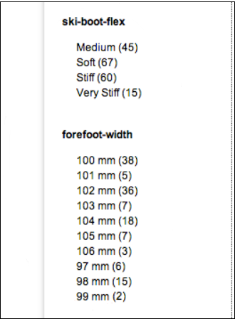
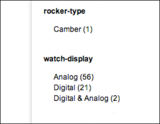
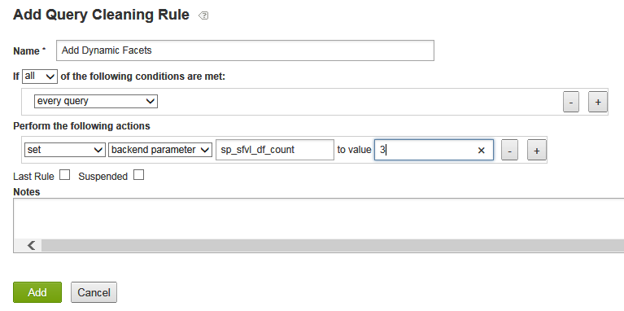
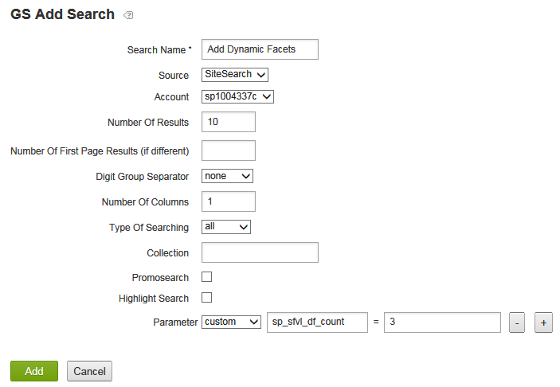
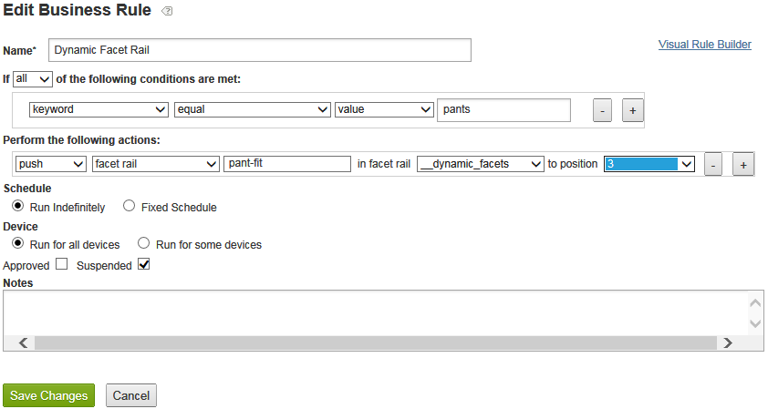

# About Dynamic Facets{#about-dynamic-facets}

Use Dynamic Facets to create new range selections automatically at the time of search. You can optionally associate each dynamic facet field with up to one table name in your Adobe Search&amp;Promote account. You apply those table relationships at search-time for any dynamic facet fields involved in the search.

## About Dynamic Facets {#concept_E65A70C9C2E04804BF24FBE1B3CAD899}

Use Dynamic Facets to create new range selections automatically at the time of search. You can optionally associate each dynamic facet field with up to one table name in your [!DNL Adobe Search&amp;Promote] account. You apply those table relationships at search-time for any dynamic facet fields involved in the search.

>[!NOTE]
>
>This feature is not enabled in [!DNL Adobe Search&amp;Promote], by default. Contact Technical Support to activate the feature for your use.

Without the use of Dynamic Facets, you had to merge related attributes into "slots", and only display the slots that were homogeneous for a given search. That is, they could only contain one logical attribute's values, such as "shoe size" or "ring size". This method provided adequate search-time performance with a large set of unique attributes.

When Dynamic Faceting is used, however, it does not place a limit on the number of facets that core search can efficiently track. You can define hundreds of dynamic facets, from which core search can return the "top `N` dynamic facets" for a given search, where `N` is typically a more modest value of 10-20 or fewer. This method eliminates the need for slotting the attributes-you can now create a unique dynamic facet for attributes across your website.

## What facets should you make dynamic? {#section_254EE034BCAD4250A5D09FBF6158C4A5}

Facets that are sparsely populated across your website and only appear for a subset of searches are good candidates to make dynamic. For example, a facet named "forefoot width" may only be populated when searching for shoes or boots. Whereas another facet named "Face Numeral Style", with possible values of "Roman" and "Arabic", may only appear when searching for watches or clocks.

If your account has a large number of such facets, it enhances search performance to use dynamic facets instead of always selecting the entire set of possible facets for every search. Generic facets such as "SKU" or "brand", which are normally appropriate to display with the results of every search, are typically not appropriate as dynamic facets.

## Relationship of facets to meta tag fields {#section_2869E5FCDA8B431A87BC6E5573F2B0A0}

Facets are built on top of meta tag fields. A meta tag field is a low-level, core search layer feature of [!DNL Adobe Search&amp;Promote]. Facets, on the other hand are part of GS (Guided Search)-the high-level, presentation layer of Adobe Search&amp;Promote. Facets own meta tag fields, however, meta tag fields know nothing about facets. When you configure dynamic facets, you first add facets and then add meta tag fields with the Dynamic Facet option selected to set the identified facet to be dynamic.

>[!NOTE]
>
>There is no "Dynamic Facet" setting in **[!UICONTROL Design]** **[!UICONTROL > Navigation]** **[!UICONTROL > Facets]**. What makes a facet "dynamic" is that its underlying "meta tag field" is dynamic as set in **[!UICONTROL Settings]** > **Metadata** > **Definitions**.

## Examples of dynamic facets in action {#section_BC699A05E2E742EF94D41679163ACE84}

Example of dynamic facets that are displayed after a search for "boots":



Another example of dynamic facets that are displayed after a search for "watches":



See also

* [Backend search CGI parameters](../c-appendices/c-cgiparameters.md#reference_582E85C3886740C98FE88CA9DF7918E8) 
* [Presentation template tags](../c-appendices/c-templates.md#reference_F1BBF616BCEC4AD7B2548ECD3CA74C64) 
* [Transport template tags](../c-appendices/c-templates.md#reference_227D199F5A7248049BE1D405C0584751)

## Configuring dynamic facets {#task_D17F484130E448258100BAC1EEC53F39}

Setting up Dynamic Facets in Search&Promotoe.

<!-- 

t_configuring_dynamic_facets.xml

 -->

>[!NOTE]
>
>This feature is not enabled in Adobe Search&amp;Promote, by default. Contact Technical Support to activate the feature for your use.

Before the effects of your dynamic facets are visible to customers, you must rebuild your site index.

See also

* [Backend search CGI parameters](../c-appendices/c-cgiparameters.md#reference_582E85C3886740C98FE88CA9DF7918E8) 
* [Presentation template tags](../c-appendices/c-templates.md#reference_F1BBF616BCEC4AD7B2548ECD3CA74C64) 
* [Transport template tags](../c-appendices/c-templates.md#reference_227D199F5A7248049BE1D405C0584751)

**To configure dynamic facets** 

1. Make sure you have already added facets.

   See [Adding a new facet](../c-about-design-menu/c-about-facets.md#task_FC07BFFA62CA4B718D6CBF4F2855C89B). 
1. After your facets are added, make sure that you have added the facets to new user-defined meta tag fields.

   See [Adding a new meta tag field](../c-about-settings-menu/c-about-metadata-menu.md#task_6DF188C0FC7F4831A4444CA9AFA615E5). 
1. On the product menu, click  **[!UICONTROL Settings]** > **[!UICONTROL Metadata]** > **[!UICONTROL Definitions.]** 
1. On the [!DNL Definitions] page, in the [!DNL User-defined fields] table, in the [!DNL Actions] column, click the pencil icon (Edit) in the row of the meta tag field name associated with the facet that you want to make dynamic.
1. On the [!DNL Edit Field] page, check **[!UICONTROL Dynamic Facet]**.

   See the table of options in [Adding a new meta tag field](../c-about-settings-menu/c-about-metadata-menu.md#task_6DF188C0FC7F4831A4444CA9AFA615E5). 
1. Click **[!UICONTROL Save Changes]**.
1. Click **regenerate your staged site index** in the blue box to quickly rebuild your staged website index.

   See also [Regenerating the index of a live or staged website](../c-about-index-menu/c-about-regenerate-index.md#task_B28DE40C0E9A475ABCBCBC4FF993AACD). 
1. Determine the number of dynamic facets to select for a given search. You accomplish this task by doing either one of the following:

* Create a query cleaning rule with any desired conditions, that performs the action `set`, `backend parameter`, `sp_sfvl_df_count` to value `X`, where `X` is the desired number of dynamic facets to request at the time of search, and then click **[!UICONTROL Add]**.

  

  See [Adding a query cleaning rule](../c-about-rules-menu/c-about-query-cleaning-rules.md#task_47F43988D3D9485F8AE1DFDA7E00BF54).

  See also [Backend search CGI parameters](../c-appendices/c-cgiparameters.md#reference_582E85C3886740C98FE88CA9DF7918E8), row 40 in the table for further explanation of `sp_sfvl_df_count`. 

* Add a search and set the "custom" `sp_sfvl_df_count` parameter to the desired value, and click **[!UICONTROL Add]**.

  

  See [Adding a new search definition](../c-about-settings-menu/c-about-searching-menu.md#task_98D3A168AB5D4F30A1ADB6E0D48AB648).

  See also [Backend search CGI parameters](../c-appendices/c-cgiparameters.md#reference_582E85C3886740C98FE88CA9DF7918E8), row 40 in the table for further explanation of `sp_sfvl_df_count`.

1. Edit the appropriate transport template to output the dynamic facets that the core search returns.

   See [Editing a presentation or a transport template](../c-about-design-menu/c-about-templates.md#task_800E0E2265C34C028C92FEB5A1243EC3).

   For example, suppose that your transport template is named `guided.tpl`. In such case, on the product menu, click **[!UICONTROL Design]** **[!UICONTROL > Templates]**. On the [!DNL Templates] page, locate `guided.tpl` in the table. and then click **[!UICONTROL Edit]** to the far right of the name. On the Editing page, add the following code block to the end of `</facets>`: JSON output:

   ```
   ... 
   }<search-dynamic-facet-fields>, 
           { 
               "name" : "<search-dynamic-facet-field-name>", 
               "dynamic-facet" : 1, 
               "values" : [<search-field-value-list quotes="yes" commas="yes" data="values" sortby="values" encoding="json" />], 
               "counts" : [<search-field-value-list quotes="yes" commas="yes" data="results" sortby="values" />] 
     
           }</search-dynamic-facet-fields> 
   ...
   ```

1. Edit the appropriate presentation template or templates to output the dynamic facets.

   See [Editing a presentation or a transport template](../c-about-design-menu/c-about-templates.md#task_800E0E2265C34C028C92FEB5A1243EC3).

   For example, suppose that you have a template named `sim.tmpl` that is used to output content in the Simulator. To edit that template, on the product menu, click **[!UICONTROL Design]** **[!UICONTROL > Templates]**. On the [!DNL Templates] page, locate `sim.tmpl` in the table. and then click **[!UICONTROL Edit]** to the far right of the name. On the Editing page, add the following within the facet display area of the template:

   ```
   <h6>DF RAIL</h6> 
   <guided-facet-rail gsname="__dynamic_facets"> 
               <guided-facet ><!-- behavior=Normal --> 
               <div class="facet-block" id="facet"> 
               <p><b><guided-facet-display-name /></b></p> 
               <ul> 
                   <guided-facet-values> 
                       <guided-if-facet-value-equals-length-threshold> 
               </ul> 
               <ul id="brand" style="display:none"> 
                       </guided-if-facet-value-equals-length-threshold> 
                       <guided-if-facet-value-selected> 
                           <li><guided-facet-value> [<guided-lt>a href="<guided-facet-value-undo-path />"<guided-gt>X</a>]</li> 
                       <guided-else-facet-value-selected> 
                           <li><guided-facet-link><guided-facet-value></guided-facet-link> (<guided-facet-count>) </li> 
                       </guided-if-facet-value-selected> 
                   </guided-facet-values> 
               </ul> 
               <guided-if-facet-long> 
                 <br /><guided-lt />a href="#" onclick="moreless(this,'brand');return false;" <guided-gt /><button style="font-size:10px;">VIEW MORE</button></a> 
               </guided-if-facet-long> 
               </div> 
               </guided-facet> 
   </guided-facet-rail> 
   <h6>/DF RAIL</h6>
   ```

   You would also make a similar modification to other Presentation templates, as needed, such as `json.tmpl`.

   Be sure that you specify `__dynamic_facets` for the `gsname` in the `guided-facet-rail` tag. This tag is a pre-defined facet rail reserved for outputting any dynamic facets that are returned for a given search.

   You can also optionally edit this special facet rail by way of Rules > Business Rules, and using the Advanced Rule Builder as seen below.

   

   See also [Adding a new business rule](../c-about-rules-menu/c-about-business-rules.md#task_BD3B31ED48BB4B1B8F1DCD3BFA2528E7) 
