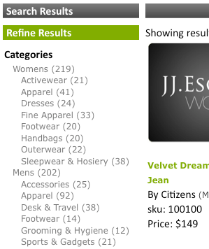

# About Facets{#about-facets}

You can use Facets to customize your presentation layer and provide your users with a Guided Search that lets them drill down into their search results.

## About Facets {#concept_FA912B3B41EE493DB2F492D188457FF5}

You can use Facets to customize your presentation layer and provide your users with a Guided Search that lets them drill down into their search results. 

For example, suppose a visitor to a website that sells tools, performs a search for wrenches. The company could use two facets: one to specify all the brands of wrenches that were found, and the second one to specify all the wrench sizes. The customer can click any brand or size within the appropriate facet to narrow the results and quickly find the correct wrench they need.

You can base a facet on any existing metadata definition. If a facet is defined as a Date type in the metadata, it is displayed as a date range facet.

The table on the [!DNL Staged Facets] page shows a general overview of the settings that make up each added facet. You can add new facets and edit or delete existing facets. You can revert any changes that you make to facets by using **[!UICONTROL History]** near the upper-right corner of the page.

Facet settings are staged by default to let you test any changes before you push them live.

See [About Staging](../c-about-staging.md#concept_08B8F3CA1F4241108F14BA7FC7806CA7).

You can use **[!UICONTROL View Live Settings]** to compare your staged settings to the current live setting. Use **[!UICONTROL View Staged Settings]** to return to the staging area. For an item that is staged, the live version of the settings is read-only. Therefore, you manipulate it by way of pushing the staged settings live. After you are satisfied with any changes that you have made to the staged facet, click **[!UICONTROL Push Live]** to push them live.

## Date Range Facets {#section_FEFFF6B5B6534456913189FEF559BA58}

Facets that are defined as type Date in the metadata are treated differently from other facets. Instead of being treated as a set of values, they are treated as a date range, with a start date, an end date, or both.

A date range facet has a value of the start date, followed by "BTW" (for "between"), followed by the end date. Dates are in the following two formats:

mm-dd-yyyy

mm/dd/yyyy

Four-digit years are required. There must be at least one of the start dates or end dates, but both are not required. For example, "12/1/2007BTW1/4/2009" means all dates between December 1, 2007 and January 4, 2009. However, "1-1-2005BTW" means all dates since January 1, 2005.

You can use the presentation template tag `<guided-facet-value/>` to get a date range facet's value, like a normal facet. Currently, JavaScript is required to allow users to enter date ranges to search on. For example, you can take the input from two entry fields for the start and end dates. Then you can validate the input, and append the new facet's value (built from the two input fields) and facet name to the existing URL.

See [Presentation template tags](../c-appendices/c-templates.md#reference_F1BBF616BCEC4AD7B2548ECD3CA74C64).

The following code sample is an example on how to present a date range on a page. It shows the existing date range if it is selected; otherwise, it presents a simple input form. When the form is submitted, it performs simple validation. It then sends the browser to a new URL that includes two new parameters:

* `q#` - Represents the selected date range assembled from the two input fields. 
* `x#` - Names the facet. In this example, the date range facet is named "modified".

The `replace(/%2F/ig, '~2F')` parts in the code are needed because Apache does not allow `%2F` in URL paths for security reasons, and when using SEO URLs the query is in the URL path. Therefore, `/` is encoded as `~2F` instead of `%2F`, as it would normally be in a URL.

```
<div class="date_range"> 
 <p>Date Range</p> 
 <guided-if-facet-selected gsname="modified"> 
  <guided-facet-values gsname="modified"> 
   <script> 
   var modified_daterange= '<guided-facet-value />'.split(/BTW/) ; 
   if (modified_daterange[0]=='') modified_daterange[0]= '--/--/----' ; 
   if (modified_daterange[1]=='') modified_daterange[1]= '--/--/----' ; 
   document.write('From: ' + modified_daterange[0]) ; 
   document.write('<br>To: ' + modified_daterange[1]) ; 
   </script> 
  </guided-facet-values> 
 
 <guided-else-facet-selected> 
  <form action="#"> 
   From: <input name="dateFrom" size=10> 
   <br>To: <input name="dateTo" size=10> 
   <br><input type="button" value="Go" onclick="goClick(this.form)"> 
  </form> 
  <script> 
  function goClick(f) { 
   if (f.dateFrom.value=='' && f.dateTo.value=='') { 
    alert('You must enter either a From: date or a To: date.') ; 
    return ; 
   } 
   if ( f.dateFrom.value!='' && !f.dateFrom.value.match(/^\d+[\/\-]\d+[\/\-]\d\d\d\d$/) ) { 
    alert('From: date must be in "mm/dd/yyyy" or "mm-dd-yyyy" format.') ; 
    return ; 
   } 
   if ( f.dateTo.value!='' && !f.dateTo.value.match(/^\d+[\/\-]\d+[\/\-]\d\d\d\d$/) ) { 
    alert('To: date must be in "mm/dd/yyyy" or "mm-dd-yyyy" format.') ; 
    return ; 
   } 
   // Note that "/" is encoded as "~2F" instead of "%2F" to avoid Apache 404 error. 
   var new_url= '<guided-current-path />&<guided-query-param-name gsname="q#" offset="0" />=' 
    + encodeURIComponent(f.dateFrom.value).replace(/%2F/ig, '~2F') + 'BTW' 
    + encodeURIComponent(f.dateTo  .value).replace(/%2F/ig, '~2F') 
    + '&<guided-query-param-name gsname="x#" offset="0" />=modified' ; 
   location.href= new_url ; 
  } 
  </script> 
 </guided-if-facet-selected> 
</div>
```

## About nested facets {#section_6BC77F38DE9F43D5B6911F8CECB15DFC}

Nested facets are facets that display multiple levels of categories as in the following:



The Womens and Mens categories are in the top or parent facet. The subcategories, such as Accessories and Footwear, are in the lower or child facet.

The current supported nested facet depth is two, but it can be anywhere along the drill-down list.

The following are the behaviors of various types of nested facets:  

<table> 
 <thead> 
  <tr> 
   <th colname="col1" class="entry"> <p>Behavior of nested facet type </p> </th> 
   <th colname="col2" class="entry"> <p>Behavior </p> </th> 
  </tr> 
 </thead>
 <tbody> 
  <tr> 
   <td colname="col1"> <p>Normal </p> </td> 
   <td colname="col2"> <p>The behavior of a normal nested facet is that it shrinks if other facets narrow the search. </p> <p>If the nested facet is selected, it shrinks down toward its selection. If a parent facet is selected, only that parent appears with all of its remaining children facets. If a child facet is selected, the facet only shows the selected parent facet and the selected child facet. </p> </td> 
  </tr> 
  <tr> 
   <td colname="col1"> <p>Sticky </p> </td> 
   <td colname="col2"> <p>The behavior of a sticky nested facet is that it tries to keep the facet open as much as possible based on the state of other facets or search criteria. If the child facet is selected, it counts toward the sticky depth. </p> </td> 
  </tr> 
  <tr> 
   <td colname="col1"> <p>Multi-Select </p> </td> 
   <td colname="col2"> <p>The behavior of a multi-select facet is that it keeps the facet open. Any new selections try to wipe out all other facet selections unless the facet is a "parent" of the category nested facet. In this case, "parent" refers to category facets, not top-level categories of a nested facet. </p> </td> 
  </tr> 
  <tr> 
   <td colname="col1"> <p>Category Multi-Select </p> </td> 
   <td colname="col2"> <p>Like Multi-Select nested facet type with the following exceptions: </p> 
    <ul id="ul_D5AB6AF3169A483E8F3FC6D2A2EA3A28"> 
     <li id="li_9308156EF2FF43CE9DFB933F13786C58">Any other facets previously chosen are deselected if this facet is selected for the first time. </li> 
     <li id="li_DD96D6802A9C479283212A0FD68C6F85">Other facets previously chosen are also deselected if the customer drills straight down to the child facet without clicking the parent facet or a sibling of a different parent facet is chosen. </li> 
     <li id="li_8BF58F10969B4743986D5D0E0086AD6C">They can have parents in the sense that category facets have parents. Do not confuse this behavior with parent-child relationships found with all nested facets. </li> 
    </ul> </td> 
  </tr> 
 </tbody> 
</table>

See also [About Facet Rail](../c-about-design-menu/c-about-facet-rails.md#concept_1FDC8BCDFFC84A0889DA670F63D5F6DB). 

## Adding a new facet {#task_FC07BFFA62CA4B718D6CBF4F2855C89B}

You can add facets to customize your presentation layer and provide your customers with a Guided Search that lets them drill down into their search results.

<!-- 

t_adding_a_new_facet.xml

 -->

The facets table on the [!DNL Facets] page shows an excerpt of the settings that make up a single facet. You can add new facets and edit or delete existing facets. Any changes you make to facets can be reverted using the History feature.

>[!NOTE]
>
>Be sure that you reference the facet in your presentation template so that it is visible on the website.

See also [About Facet Rail](../c-about-design-menu/c-about-facet-rails.md#concept_1FDC8BCDFFC84A0889DA670F63D5F6DB).

**To add a new facet** 

1. Before you can add a new facet, make sure that you have already done following before you proceed to the next step:

    * Have some meta tag fields already defined.

      See [Adding a new meta tag field](../c-about-settings-menu/c-about-metadata-menu.md#task_6DF188C0FC7F4831A4444CA9AFA615E5). 
    * Inject the metadata into your index.
      See [Adding field injection definitions](../c-about-settings-menu/c-about-metadata-menu.md#task_E86566FA1FF74CF68115C0ADA05172AE).

1. On the product menu, click **[!UICONTROL Design]** > **[!UICONTROL Navigation]** > **[!UICONTROL Facets.]**
1. On the [!DNL Facets] page, click **[!UICONTROL Add New Facet]**.
1. On the [!DNL Add Facet] page, set the options that you want.

   These settings affect both the behavior and the default presentation of a facet. You can override some of these settings by way of the presentation template's settings.

   If a facet is defined as a Date type in the metadata, it is displayed as a date range.

   See [Date Range Facets](../c-about-design-menu/c-about-facets.md#section_FEFFF6B5B6534456913189FEF559BA58).

   Depending on the facet options that you select, not all options are available.

   <!-- 
   r_add_facet_options.xml
   -->

    <table> 
    <thead> 
      <tr> 
      <th colname="col1" class="entry"> <p>Option </p> </th> 
      <th colname="col2" class="entry"> <p>Description </p> </th> 
      </tr> 
    </thead>
    <tbody> 
      <tr> 
      <td colname="col1"> <p>Facet Name </p> </td> 
      <td colname="col2"> <p>Identifies the name of a given facet. </p> <p> <p>Note:  You can only have a facet based on existing user-defined metadata. If there are no facets available in the drop-down list, then you must first define some metadata. </p> </p> <p>See <a href="../c-about-settings-menu/c-about-metadata-menu.md#task_6DF188C0FC7F4831A4444CA9AFA615E5" type="task" format="dita" scope="local"> Adding a new meta tag field </a>. </p> <p>To build a facet based on a field table, use the custom facet name and specify your field table name. </p> </td> 
      </tr> 
      <tr> 
      <td colname="col1"> <p>Display Label </p> </td> 
      <td colname="col2"> <p>Sets the label of a facet which can then be used in a breadcrumb, instead of a metadata fieldname (with the <span class="codeph"> &lt;guided-breadcrumb-label&gt; </span> tag) or a stand-alone value (with the <span class="codeph"> &lt;guided-facet-display-name&gt; </span> tag). </p> </td> 
      </tr> 
      <tr> 
      <td colname="col1"> <p>Behavior </p> </td> 
      <td colname="col2"> <p>Sets one of three facet behaviors. </p> <p> 
      <ul id="ul_67C19E1C16224B9990F04A0D05BD3D05"> 
      <li id="li_6B232C11A61840B68CA59E1F593405A0"> <span class="uicontrol"> Normal </span> <p>When a customer clicks a facet whose behavior is set to <span class="uicontrol"> Normal </span>, it drills into the search results for that item. From there, the customer can further refine and narrow the number of search results. </p> </li> 
      <li id="li_7D7C43A7F7AB4B84A9B0FEF34627605A"> <span class="uicontrol"> Category </span> <p>Category facets act like navigational elements. These facets are top-level facets that customers typically drill through before revealing facets with attribute options. Category facets do not narrow when other facets are selected and remain open. Clicking a different value within a category facet deselects all other facets on the page except for that category facet's parents. </p> </li> 
      <li id="li_01255993D71F40DBA8870AA3FEA7D304"> <span class="uicontrol"> Category Multi-Select </span> <p>facets are category facets that support the selection of multiple items from the facet where the items are "ORed" together. </p> </li> 
      </ul> 
      <ul id="ul_683F6D3FC8524E65AF303453ADDB6001"> 
        <li id="li_81F504D1D1294666BBBC5EA43B34B712"> <span class="uicontrol"> Sticky </span> <p>When a customer clicks a facet whose behavior is set to <span class="uicontrol"> Sticky </span>, the facet with the selected option remains open during the drill-down. This option is useful when you want to let a customer change a previous choice. </p> </li> 
      </ul> 
      <ul id="ul_8E871D63B09445268C600C8ABC20F6A4"> 
        <li id="li_F88AC5528B0C4751BC4CFE7FA9525857"> <span class="uicontrol"> Multi-Select </span> <p>Allows the selection of multiple items from a facet, where the items within the facet are "ORed" together. This option is useful for a facet that may show a minor attribute such as colors and you want to let the customer have the ability to build a query that lets them "show shoes in my size that are red or black". </p> </li> 
      </ul> </p> </td> 
      </tr> 
      <tr> 
      <td colname="col1"> <p>Show Always </p> </td> 
      <td colname="col2"> <p>For a normal or sticky facet, sets the facet to remain visible to the customer at all times. </p> <p>This option is only available if you selected <span class="uicontrol"> Normal </span>, <span class="uicontrol"> Category </span>, or <span class="uicontrol"> Sticky </span> from the <span class="uicontrol"> Behavior </span> drop-down list. </p> </td> 
      </tr> 
      <tr> 
      <td colname="col1"> <p>Facet's Parents </p> </td> 
      <td colname="col2"> <p>This option is only available if you selected <span class="uicontrol"> Category </span> or <span class="uicontrol"> Category Multi-Select </span> from the <span class="uicontrol"> Behavior </span> drop-down list. </p> <p>Indicates what the category facet's parents are. The selected items in the categories parent facets are used to narrow the choices that are available within the current category facet. Parent facets are not deselected when a customer interacts with the category facet. You can specify multiple comma-delimited parents. </p> </td> 
      </tr> 
      <tr> 
      <td colname="col1"> <p>Sticky Depth </p> </td> 
      <td colname="col2"> <p>This option is only available if you selected <span class="uicontrol"> Sticky </span> from the <span class="uicontrol"> Behavior </span> drop-down list. </p> <p>Sets the number of options to remain open during the drill-down. </p> </td> 
      </tr> 
      <tr> 
      <td colname="col1"> <p>Length Threshold </p> </td> 
      <td colname="col2"> <p>Sets the vertical length (1-9999) of the facet defined in number of items. </p> <p>If your presentation template is set up appropriately, you can use this setting to provide a "Show more..." link, or determine when to throw the facet into a scrollable div, and so on. </p> </td> 
      </tr> 
      <tr> 
      <td colname="col1"> <p>Truncate Length Threshold </p> </td> 
      <td colname="col2"> <p>Truncates the number of items in a facet after a given threshold. </p> <p>Some implementations have facets with thousands of items in them. It can be expensive to send all the data over the wire. You can use this setting to trim the facet down to a manageable level. The facet will be truncated after sorting. </p> </td> 
      </tr> 
      <tr> 
      <td colname="col1"> <p>Max Value Width </p> </td> 
      <td colname="col2"> <p>Specifies a limit to the length of the facet value string (1-999). </p> <p>This option is useful when you want to put a facet in a fixed width layout and keep strings from wrapping. By default, the string is set to 3 characters shorter than the threshold so that an ellipsis can be added. </p> </td> 
      </tr> 
      <tr> 
      <td colname="col1"> <p>Value Extension </p> </td> 
      <td colname="col2"> <p>Specifies the string that you want use to indicate that a facet's value is truncated. By default the string "..." is used. </p> </td> 
      </tr> 
      <tr> 
      <td colname="col1"> <p>Delimiter </p> </td> 
      <td colname="col2"> <p>Specifies the delimiter to use for any delimited separated value list that applies to the facet. </p> <p>The delimiter that is used is the same one that is defined in the metadata on which the facet is based. The default delimiter is a comma. However, you can use any XML-compliant value. </p> </td> 
      </tr> 
      <tr> 
      <td colname="col1"> <p>Sort </p> </td> 
      <td colname="col2"> <p>Specifies how you want facets sorted on your website. You can have facets sorted by the following. If desired, you can combine up to five sorts. </p> 
      <ul id="ul_12987F4DC7B34C63ABC906B59688A174"> 
      <li id="li_3206C96013DF431D90119F594D93D85D"> <span class="uicontrol"> alpha </span> <p>Sorts the values alphabetically (0-9, A-Z), including punctuation characters. </p> </li> 
      <li id="li_304E4A518FBE48D18D9E9EA7339A3481"> <span class="uicontrol"> alpha (alphanumeric only) </span> <p>Sorts the values alphabetically (0-9, A-Z), ignoring punctuation characters. </p> </li> 
      <li id="li_CADB888CC514455F9CA379C8EEE490AA"> <span class="uicontrol"> alpha (not case sensitive) </span> <p>Sorts the values alphabetically (0-9, A-Z), ignoring the case of alphabetic characters, and including punctuation characters. </p> </li> 
      <li id="li_F61122E79AB5413792DA31F8AB1414BD"> <span class="uicontrol"> alpha (not case sensitive, alphanumeric only) </span> <p>Sorts the values alphabetically (0-9, A-Z), ignoring the case of alphabetic characters, and ignoring punctuation characters. </p> </li> 
      <li id="li_F50CC298ABF046D0A39D5AE5B1261823"> <span class="uicontrol"> count </span> <p>Sorts by number of results matching each facet value from greatest to least. </p> </li> 
      <li id="li_32B6AF39E9534762B39B15181DC5AD01"> <span class="uicontrol"> numeric </span> <p>Sorts the values numerically. When sorting numbers, this option is superior to an Alpha sort because if you use an Alpha sort, 10 displays before 2. </p> </li> 
      <li id="li_CF8E76A7B1184E0C8DCC11B53E31A1DC"> <span class="uicontrol"> split </span> <p>Breaks the list into two separate lists by count threshold. Facet values above the threshold are moved to the top. Facet values with counts below the threshold are moved to the bottom. A split-threshold is required when you want to force values of a certain range to always be at the top. </p> </li> 
      <li id="li_4AB8276577384B1099CBA895898205AD"> <span class="uicontrol"> break </span> <p>Forces certain values to the top or the bottom of the list. For example, you may always want the term "Other" to appear at the bottom of the list. Either top-values or bottom-values are required when you use a break sort to identify the explicit values that should be at the top or the bottom of the sort. </p> </li> 
      <li id="li_227E96CFED2044FCA2F10B6913B03CFB"> <span class="uicontrol"> ordered </span> <p>The facet values should always be in a fixed order (a delimiter separated value list defined in the <span class="uicontrol"> Order </span> option described below). </p> </li> 
      </ul> </td> 
      </tr> 
      <tr> 
      <td colname="col1"> <p>Facet's Alias </p> </td> 
      <td colname="col2"> <p>To support existing search URLs that you may have out in the wild, you can use a facet alias to map legacy parameter name to modified or just create a facet with a different name. The alias is applied to incoming requests only and is not used to create facet links. </p> </td> 
      </tr> 
      <tr> 
      <td colname="col1"> <p>Facet Rail Name </p> </td> 
      <td colname="col2"> <p>The name of the facet rail if you decide to sort your facets alphabetically, by count, or by a custom method. </p> <p>See <a href="../c-about-design-menu/c-about-facet-rails.md#concept_1FDC8BCDFFC84A0889DA670F63D5F6DB" format="dita" scope="local"> About Facet Rail </a>. </p> </td> 
      </tr> 
      <tr> 
      <td colname="col1"> <p>Order </p> </td> 
      <td colname="col2"> <p>This option is only available if you selected <span class="uicontrol"> Ordered </span> from the <span class="uicontrol"> Sort </span> drop-down list. </p> <p>Lets you define a delimited list of values that specifies the order to use. </p> </td> 
      </tr> 
      <tr> 
      <td colname="col1"> <p>Append Extras </p> </td> 
      <td colname="col2"> <p>This option is only available if you selected <span class="uicontrol"> Ordered </span> from the <span class="uicontrol"> Sort </span> drop-down list. </p> <p>If the values are not present in the ordered list, the values are appended to the end. </p> </td> 
      </tr> 
      <tr> 
      <td colname="col1"> <p>Show Ghosts </p> </td> 
      <td colname="col2"> <p>This option is only available if you selected <span class="uicontrol"> Ordered </span> from the <span class="uicontrol"> Sort </span> drop-down list. </p> <p>If the values that are specified by the ordered list are missing, this option flags each missing item in the facet as "ghost" so that the items are displayed differently. </p> </td> 
      </tr> 
      <tr> 
      <td colname="col1"> <p>Nested Facet </p> </td> 
      <td colname="col2"> <p>A nested facet displays its categories and its children's categories. It can only show a depth of two categories, but it can be anywhere along the drill-down. </p> <p>The data for this facet must follow a convention in describing the two levels of categories. For example, a facet value can be 'shoes:boots' where the parent category is 'shoes' and the child category is 'boots'. The ':' is used as a delimiter to separate them. </p> <p>See Nested Delimiter below for more information about changing the delimiter. </p> <p>To generate the data in this format, you can use a filter script to combine two existing categories. You can combine Normal, Category, and Sticky behaviors with nested facets. </p> </td> 
      </tr> 
      <tr> 
      <td colname="col1"> <p>Nested Parent Name </p> </td> 
      <td colname="col2"> <p>This drop-down list is only available if you selected <span class="uicontrol"> Nested Facet </span>. </p> <p>Lets you choose which field represents the parent category. This field is used during search time in matching parent categories. </p> </td> 
      </tr> 
      <tr> 
      <td colname="col1"> <p>Nested Child Name </p> </td> 
      <td colname="col2"> <p>This drop-down list is only available if you selected <span class="uicontrol"> Nested Facet </span>. </p> <p>Lets you choose which field represents the child category. This field is used during search time in matching child categories. </p> </td> 
      </tr> 
      <tr> 
      <td colname="col1"> <p>Nested Facet Delimiter </p> </td> 
      <td colname="col2"> <p>This option is only available if you selected <span class="uicontrol"> Nested Facet </span>. </p> <p>The character entered here is used to parse the parent categories and children categories from its data. </p> <p>For example, if ':' is used as a delimiter and the parent is 'shoes' and the child is 'boots', it expects the data to be formatted as 'shoes:boots'. </p> </td> 
      </tr> 
      <tr> 
      <td colname="col1"> <p>Split Threshold </p> </td> 
      <td colname="col2"> <p>This option is only available if you selected <span class="uicontrol"> Split </span> from the <span class="uicontrol"> Sort </span> drop-down list. </p> <p>When using a Split sort, the split-threshold defines the count at which to split the facet into two separate lists. Values with counts greater than or equal to the threshold are kept at the top while values below the threshold are moved to the bottom. </p> </td> 
      </tr> 
      <tr> 
      <td colname="col1"> <p>Top Values </p> </td> 
      <td colname="col2"> <p>This option is only available if you selected <span class="uicontrol"> Break </span> from the <span class="uicontrol"> Sort </span> drop-down list. </p> <p>When using a Break sort, this delimited list of values is always placed at the top of the list. Use of regular expressions is allowed but they should be in curly brackets or braces, for example: {^New .*?},{^Very New .*} </p> </td> 
      </tr> 
      <tr> 
      <td colname="col1"> <p>Bottom Values </p> </td> 
      <td colname="col2"> <p>This option is only available if you selected <span class="uicontrol"> Break </span> from the <span class="uicontrol"> Sort </span> drop-down list. </p> <p>When using a Break sort, this delimited list of values is always placed at the bottom of the list. Use of regular expressions is allowed but they should be in curly brackets or braces, as in the following example: {^Old .*?},{^Very Old .*} </p> </td> 
      </tr> 
    </tbody> 
    </table>

1. Click **[!UICONTROL Add]**.
1. (Optional) On the [!DNL Facets] page, do one of the following:

    * Click **[!UICONTROL History]** to revert any changes that you have made.

      See [Using the History option](../t-using-the-history-option.md#task_70DD3F87A67242BBBD2CB27156F43002). 
    
    * Click **[!UICONTROL Live]**.

      See [Viewing live settings](../c-about-staging.md#task_401A0EBDB5DB4D4CA933CBA7BECDC10F). 
    
    * Click **[!UICONTROL Push Live]**.

      See [Pushing stage settings live](../c-about-staging.md#task_44306783B4C0408AAA58B471DAF2D9A4).

## Adding a nested facet {#task_A132FA7EB7494A6B88E443F2C3FABBBA}

You can add a nested facet to display multiple levels of categories.

<!-- 

t_adding_a_nested_facet.xml

 -->

Keep the following in mind when you create a nested facet:

* Each nested facet requires one user-defined meta tag field. 
* Nested facets are composed of two other facets, the parent facet and the child facet. They can be single value facets or multi-value facets. The mixing of single-value facets and multi-value facets is not allowed. 
* You need to determine if this facet will be used in the search field table. The field table requires the nested facet itself and its compositing facets. 
* Consider using JSON to implement nested facets; it is easier.

* [Task 1 - Add a meta tag](../c-about-design-menu/c-about-facets.md#task_6944558325204E749C725DCFEF17EF3D) 
* [Task 2 - Add a filtering script to generate pre-formatted data](../c-about-design-menu/c-about-facets.md#task_2DFED8BCB87B4067A6CE280945D7CAF4) 
* [Task 3 - Add a new facet](../c-about-design-menu/c-about-facets.md#task_3C11A4159FC44B9494D48594941AF8CF) 
* [Task 4 - Edit Guided Search Searching](../c-about-design-menu/c-about-facets.md#task_E50EFD7BBD0F45729C15759EA4F548D8) 
* [Task 5 - Create the Transport Template](../c-about-design-menu/c-about-facets.md#task_C1FEDEF11D2549DEB1A9C09BFBA64381) 
* [Task 6 - Create the Presentation Template](../c-about-design-menu/c-about-facets.md#task_4B2ABB37B9CD4F3F8AF8E6874227A995) 
* [Task 7 - Edit the Breadcrumb](../c-about-design-menu/c-about-facets.md#task_5E22409528EC4DA284821F82FDCE3438)

>[!NOTE]
>
>This topic refers to the nested facet as facet n1.

## Task 1 - Add a meta tag {#task_6944558325204E749C725DCFEF17EF3D}

Add a new meta tag field that is dedicated to holding date for the nested facet. It can be a multi-value field or a single value field.

1. On the product menu, click **[!UICONTROL Settings]** > **[!UICONTROL Metadata]** > **[!UICONTROL Definitions]**.
1. On the [!DNL Definitions] page, click **[!UICONTROL Add New Field]**.
1. On the [!DNL Add Field] page, set the options that you want.

   See [Adding a new meta tag field](../c-about-settings-menu/c-about-metadata-menu.md#task_6DF188C0FC7F4831A4444CA9AFA615E5). 
1. Click **[!UICONTROL Add]**.
1. (Optional) Rebuild your staged site index if you want to preview the results.

   See [Configuring an incremental index of a staged website](../c-about-index-menu/c-about-incremental-index.md#task_46A367B0786C4C90BFFA5D3F95FD86C0).

   The remaining tasks refer to this meta tag field as **n1**. 

## Task 2 - Add a filtering script to generate pre-formatted data {#task_2DFED8BCB87B4067A6CE280945D7CAF4}

1. Add a filtering script to combine the original facets into the following format: `<parent_value><nested_delimiter><child_value>`.

   See [Adding a filtering script](../c-about-settings-menu/c-about-filtering-menu.md#task_0AB84FD1133F47F9AA069A79BEA13A22).

   The following are examples of values for meta tag field n1, using the above format

   `Womens:Handbags`

   `Womens:Dresses`

   `Mens:Accessories`

   `Mens:Footwear` 
1. After you create or edit the filtering script, test the script. If it looks right, reindex your account, if appropriate. You can check the index using [!DNL Index Overview].

   See [About Index Overview](../c-about-index-menu/c-about-index.md#concept_967E159A7C3240FAA6B2A9343121D0AA).

   The following examples assume that you have some standard consulting libraries included with the filtering script initialization. Remember that every account is different, so your filtering script should reflect the necessary requirements for your own account.

   **Example of a multi-value filtering script**

   ```
   my $doc; 
   { 
   # Slurp all the data into $doc 
   local $/; 
   undef $/; 
   $doc = <>; 
   } 
    # Create n1 field 
    if ( $doc =~ m{<meta\s+name="t1"\s+content="([^\"]*)"}is ) 
    { 
     my @t1arr = split(/\|/, $1); 
     if (scalar @t1arr > 0) 
     { 
      if ( $doc =~ m{<meta\s+name="t2"\s+content="([^\"]*)"}is ) 
      { 
       my @t2arr = split(/\|/, $1); 
        
       if ( scalar @t2arr > 0 ) 
       { 
        my $max = ((scalar @t1arr) < (scalar @t2arr)) ? (scalar @t1arr) : (scalar @t2arr); 
        for (my $i = 0; $i < $max; $i++) 
        { 
         $t1arr[$i] .= ":" . $t2arr[$i]; 
        } 
       } 
      } 
      my $output = join( '|', @t1arr ); 
      $doc =~ s{</head>}{<meta name="n1" content="$output" />\b</head>}is; 
     } 
    } 
    # END: n1 field
   ```

   **Example of a single value filtering script**

   ```
   # This is a complete example. 
   # This script is designed for index connector where each record 
   # in the XML file is converted into a fake HTML page filled with 
   # meta data tags.  
   my $doc; 
   { 
   # Slurp all the data 
   local $/; 
   undef $/; 
   $doc = <>; 
   } 
   # All legitimate index connector data has key in its URL. 
   # Process the page if and only if it is coming from index connector and 
   # it is not the first entry point page.  Entry point pages don't have key 
   # in the URL. 
   if ($main::search_url =~ /\?key=/) { 
    my $meta = {}; 
    # Mine and scrape the meta fields from the page 
    my @lines = split(/\n/,$doc); 
    foreach my $line (@lines) 
    { 
     if ($line =~ m{<meta name="(.*?)" content="(.*?)" />}) 
     { 
      $meta->{lc($1)} = $2; 
     } 
    } 
    # Combined t1,t2 and t2,t3, and t3,t4 together. 
    # Assign them respectively to n1, n2, and n3. 
    my ($t1, $t2, $t3, $t4); 
    my %meta2; 
    $t1 = $meta->{'t1'}; 
    $t2 = $meta->{'t2'}; 
    $t3 = $meta->{'t3'}; 
    $t4 = $meta->{'t4'}; 
    if (defined $t1 && $t1) { 
     $meta2{'n1'} = $t1; 
     if (defined $t2 && $t2) { 
      $meta2{'n1'} .= ":" . $t2; 
      $meta2{'n2'} = $t2; 
      if (defined $t3 && $t3) { 
      $meta2{'n2'} .= ":" . $t3; 
       $meta2{'n3'} = $t3; 
       if (defined $t4 && $t4) { 
        $meta2{'n3'} .= ":" . $t4; 
       } 
      } 
     } 
    } 
    foreach my $stuff ( keys %meta2 ) 
    { 
     my $v = $meta2{$stuff}; 
     $doc =~ s{</head>}{<meta name="$stuff" content="$v" />\n</head>}; 
    } 
   } 
    
   # Do some ranking stuff here 
   ws_insert_static_rank_meta_tag(\$doc, "RANK"); 
    
   # Prints the entire page back out. 
   print $doc;
   ```

## Task 3 - Add a new facet {#task_3C11A4159FC44B9494D48594941AF8CF}

1. On the product menu, click **[!UICONTROL Design]** > **[!UICONTROL Navigation]** > **[!UICONTROL Facets]**.
1. On the [!DNL Facets] page, click **[!UICONTROL Add New Facet]**.
1. On the [!DNL Add Facet] page, set the following options:

* In the [!DNL Facet Name] drop-down list, select the meta tag field that you defined in Task 1. If you are using search field tables, select **[!UICONTROL custom]** in the drop-down list, and then enter the custom name of the facet. 

* Check **[!UICONTROL Nested Facet]** to "turn on" nested facets. 
* In the [!DNL Nested Parent Name] and [!DNL Nested Child Name] drop-down lists, choose the meta tag fields you can to use. If you are using search field tables, select **[!UICONTROL custom]** and enter the custom name of the facet. 

* In the [!DNL Nested Facet Delimiter] field, specify the delimiter that you want to use, such as a ":" (colon). Do not confuse this with the multi-value delimiter. Both delimiters should be different from each other. 
* If you set the facet's behavior **[!UICONTROL Category]**, you can specify the facet's parents (do not confuse parent with nested facet parents). In general, never use the name of another nested facet as a Category parent. Instead, use the individual facets composing that nested facet. 
* Set any other facet options you want.

   See [Adding a new facet](../c-about-design-menu/c-about-facets.md#task_FC07BFFA62CA4B718D6CBF4F2855C89B). 
1. Click **[!UICONTROL Add]**.

## Task 4 - Edit Guided Search Searching {#task_E50EFD7BBD0F45729C15759EA4F548D8}

1. On the product menu, click **[!UICONTROL Settings]** > **[!UICONTROL Searching]** > **[!UICONTROL Searches]**.
1. On the [!DNL Searches] pages, click **[!UICONTROL Edit]** on the search type name that you want to update.
1. The `sp_field_table` needs field n1, t1, and t2.

   If field tables are used, you should edit the `sp_field_table` parameter. Or, you can accomplish this elsewhere by using query cleaning rules or pre-search rules.

   See [Adding a query cleaning rule](../c-about-rules-menu/c-about-query-cleaning-rules.md#task_47F43988D3D9485F8AE1DFDA7E00BF54).

   See [Adding a new pre-search rule](../c-about-rules-menu/c-about-pre-search-rules.md#task_182B95918462490D8BDA7F16A81CAC11). 
1. Click **[!UICONTROL Save Changes]**.

## Task 5 - Create the Transport Template {#task_C1FEDEF11D2549DEB1A9C09BFBA64381}

1. On the product menu, click **[!UICONTROL Design]** > **[!UICONTROL Templates]**.
1. On the [!DNL Templates] pages, click **[!UICONTROL Add New Template]**.
1. In the [!DNL Add Template] dialog box, specify the name of the transport template file.
1. In the [!DNL New Template Type] drop-down list, select **[!UICONTROL Transport]**.
1. Click **[!UICONTROL Add]**.
1. On the [!DNL Templates] page, click the name of the transport template file name you just added.
1. On the [!DNL Template Editor] page for your transport template, include the data that is coming from the field n1. See the following examples.

   **XML example of returning nested facet data** The XML example needs to specify which character is used as the delimiter between facet values. In this case, it is a pipe (|).

   ```
   <facet name="n1"> 
     <values delimiter="|"><search-field-value-list name="n1" quotes="no" separator="|" sortby="values" data="values" /></values> 
     <counts><search-field-value-list name="n1" quotes="no" sortby="values" data="results" /></counts> 
   </facet>
   ```

   **JSON example of returning nested facet data**

   ```
   { 
      "name" : "n1", 
      "values" : [ <search-field-value-list name="n1" quotes="yes" sortby="values" data="values" encoding="json"/>], 
      "counts" : [<search-field-value-list name="n1" quotes="no" sortby="values" data="results" />] 
   },
   ```

## Task 6 - Create the Presentation Template {#task_4B2ABB37B9CD4F3F8AF8E6874227A995}

1. On the product menu, click **[!UICONTROL Design]** > **[!UICONTROL Templates]**.
1. On the [!DNL Templates] pages, click **[!UICONTROL Add New Template]**.
1. In the [!DNL Add Template] dialog box, specify the name of the presentation template file.
1. In the [!DNL New Template Type] drop-down list, select **[!UICONTROL Presentation]**.
1. Click **[!UICONTROL Add]**.
1. On the [!DNL Templates] page, click the name of the presentation template file name you just added.
1. On the [!DNL Template Editor] page for your presentation template, add HTML markup that integrates with your expected output.

   You can use the following tags to display child tags:

* **If Child Exist tags** `<guided-if-facet-value-has-children><guided-else-facet-value-selected></guided-if-facet-value-has-children>` 

* **Child Value tags** `<guided-facet-value-children></guided-facet-value-children>`

  The Child Value tags do not behave like normal guided-facet-value tags. The are wrapper tags forcing all encompassing `<guided-facet-value>` tags to iterate through children facet values instead of parent facet values. Likewise, other guided-facet tags, like the undo tags, follow the same thing. They are best used within `<guided-if-facet-value-has-children>` tags.

   The following is an example of a presentation template with HTML markup.

   ```
   <guided-facet gsname="n1"> 
   <guided-if-facet-selected> 
    <guided-facet-values> 
    <guided-if-facet-value-selected> 
     <li><span class="selected"><guided-facet-value /></span><guided-facet-value-undo-link gsname="n1">X</guided-facet-value-undo-link></li> 
     <guided-if-facet-value-has-children> 
      <ul> 
      <guided-facet-value-children> 
      <guided-if-facet-value-selected> 
       <li><span class="selected"><guided-facet-value /></span><guided-facet-value-undo-link gsname="n1">X</guided-facet-value-undo-link></li> 
      <guided-else-facet-value-selected> 
       <li><guided-facet-link title='<guided-facet-value />'><guided-facet-value /> (<guided-facet-count />)</guided-facet-link> </li> 
      </guided-if-facet-value-selected> 
      </guided-facet-value-children> 
      </ul> 
     </guided-if-facet-value-has-children> 
    <guided-else-facet-value-selected> 
     <li><guided-facet-link title='<guided-facet-value />'><guided-facet-value /> (<guided-facet-count />)</guided-facet-link> </li> 
     <guided-if-facet-value-has-children> 
      <ul> 
      <guided-facet-value-children> 
       <li><guided-facet-link title='<guided-facet-value />'><guided-facet-value /> (<guided-facet-count />)</guided-facet-link> </li> 
      </guided-facet-value-children> 
      </ul> 
     </guided-if-facet-value-has-children> 
    </guided-if-facet-value-selected> 
    </guided-facet-values> 
   <guided-else-facet-selected>  
    <guided-facet-values> 
    <guided-if-facet-value-selected> 
     <li><span class="selected"><guided-facet-value /></span><guided-facet-value-undo-link gsname="n1">X</guided-facet-value-undo-link></li> 
     <guided-if-facet-value-has-children> 
      <ul> 
      <guided-facet-value-children> 
       <li><guided-facet-link title='<guided-facet-value />'><guided-facet-value /> (<guided-facet-count />)</guided-facet-link> </li> 
      </guided-facet-value-children> 
      </ul> 
     </guided-if-facet-value-has-children> 
    <guided-else-facet-value-selected> 
     <li><guided-facet-link title='<guided-facet-value />'><guided-facet-value /> (<guided-facet-count />)</guided-facet-link> </li> 
     <guided-if-facet-value-has-children> 
      <ul> 
      <guided-facet-value-children> 
       <li><guided-facet-link title='<guided-facet-value />'><guided-facet-value /> (<guided-facet-count />)</guided-facet-link> </li> 
      </guided-facet-value-children> 
      </ul> 
     </guided-if-facet-value-has-children> 
    </guided-if-facet-value-selected> 
    </guided-facet-values> 
   </guided-if-facet-selected> 
   </guided-facet>
   ```

## Task 7 - Edit the Breadcrumb {#task_5E22409528EC4DA284821F82FDCE3438}

If you are using breadcrumbs in your search, you need to set the behavior to **Go To**.

1. On the product menu, click **[!UICONTROL Design]** > **[!UICONTROL Navigation]** > **[!UICONTROL Breadcrumbs]**.
1. On the [!DNL Breadcrumbs] pages, click **[!UICONTROL Edit]** on the breadcrumb name whose behavior you want to update.
1. On the [!DNL Edit Breadcrumb] page, in the [!DNL Behavior] drop-down list, select **Go To**.
1. Click **[!UICONTROL Save Changes]**.

## Editing a facet {#task_457EDC49983F4F7781873703AF574DA5}

You can edit the settings of any facet that you have added.

<!-- 

t_editing_a_facet.xml

 -->

>[!NOTE]
>
>Be sure you reference the facet in your presentation template so that it is visible on the website.

**To edit a facet** 

1. On the product menu, click **[!UICONTROL Design]** > **[!UICONTROL Navigation]** > **[!UICONTROL Facets.]**
1. On the [!DNL Facets] page, click **[!UICONTROL Edit]** to the far right of a facet name.
1. On the [!DNL Edit Facet] page, set the options that you want.

   See the table of options under [Adding a new facet](../c-about-design-menu/c-about-facets.md#task_FC07BFFA62CA4B718D6CBF4F2855C89B). 
1. Click **[!UICONTROL Save Changes]**.
1. (Optional) On the [!DNL Facets] page,

    * Click **[!UICONTROL History]** to revert any changes that you have made.

      See [Using the History option](../t-using-the-history-option.md#task_70DD3F87A67242BBBD2CB27156F43002). 
    
    * Click **[!UICONTROL Live]**.

      See [Viewing live settings](../c-about-staging.md#task_401A0EBDB5DB4D4CA933CBA7BECDC10F). 
    
    * Click **[!UICONTROL Push Live]**.

      See [Pushing stage settings live](../c-about-staging.md#task_44306783B4C0408AAA58B471DAF2D9A4).

## Deleting a facet {#task_17756FD66BCC49629325B2217F821BDD}

You can delete any facet that you have added.

<!-- 

t_deleting_a_facet.xml

 -->

**To delete a facet** 

1. On the product menu, click **[!UICONTROL Design]** > **[!UICONTROL Navigation]** > **[!UICONTROL Facets]**.
1. On the [!DNL Facets] page, click **[!UICONTROL Delete]** to the far right of a facet name.
1. In the [!DNL Confirmation] dialog box, click **[!UICONTROL OK]**.
1. Do one of the following:

    * Click **[!UICONTROL History]** to revert any changes that you have made.

      See [Using the History option](../t-using-the-history-option.md#task_70DD3F87A67242BBBD2CB27156F43002). 
    
    * Click **[!UICONTROL Live]**.

      See [Viewing live settings](../c-about-staging.md#task_401A0EBDB5DB4D4CA933CBA7BECDC10F). 
    
    * Click **[!UICONTROL Push Live]**.

      See [Pushing stage settings live](../c-about-staging.md#task_44306783B4C0408AAA58B471DAF2D9A4).

