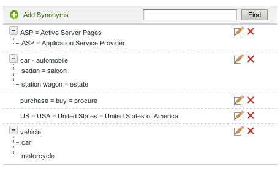

# About Dictionaries{#about-dictionaries}

You can use Dictionaries to manage a collection of dictionaries and their associated synonyms and hyponyms.

## About Dictionaries {#concept_B8028B71EC8144669614C64578EDB034}

You can use Dictionaries to manage a collection of dictionaries and their associated synonyms and hyponyms. 

Synonyms are words that have the same or similar meaning such as pants, jeans, trousers, and slacks, or buy, purchase, acquire, and order.

Hyponyms are one-way synonyms, and provide a solution when synonyms would be inappropriate. For example, an apparel retail site’s top search term is “pants”. However, jeans do not appear in the search results. In such case, you can use a hyponym to associate jeans with pants, but to allow a search for jeans to return only jeans. Use hyponyms to also provide a match for discontinued products or competitive terms. This strategy ensures minimal impact on other search results. For example, if the “S2000” product is discontinued and the “S3000” is its successor, use a hyponym instead of a synonym to ensure that the search results for “S3000” do not include any stray “S2000” results.

Synonyms and hyponyms help customers find relevant search results when they enter non-exact matching terms that do not exist on the web pages. For example, if the word "pants" is used throughout your website, you can create a synonym that bind "pants" and "trousers" together. In turn, when customers search for "trousers," search results are returned that are related to pants.

Synonyms and hyponyms are grouped together as Domain Dictionaries. These are special dictionaries that you create for a specific theme or purpose.

The Dictionary Menu page lists all the domain dictionaries that your account currently has defined. From this main page, you can rename, edit, delete, or enable and disable domain dictionaries.

## Understanding synonym and hyponym notation {#section_B459CCB850974F4FB16A14E489BBBEC0}

The following image is an example of a group of terms with both synonym and hyponym relationships. 

Six main synonym relationships are explicitly defined. Each term is separated by equal signs (=).

* "Car" is a synonym of automobile. 
* "Sedan" is a synonym of saloon. 
* "Station wagon" is a synonym of estate. 
* "ASP" is a synonym of Active Server Pages and Application Service Provider. 
* "Purchase", "buy", and "procure" are synonyms of each other. 
* "US", "USA", and "United States of America" are synonyms of each other.

Rows that contain a single word are plain synonyms. Rows with expandable trees form hyponym relationships. In the example, the second tree defines sedan, saloon, station wagon, and estate as hyponyms of car and automobile. Conversely, car and automobiles are hypernyms of the rest of the terms in the tree.

The third tree defines car and motorcycle as hyponyms of vehicle.

You can include more than one acronym and/or multi-word expansion in each synonym, as seen in the "US" synonym example above. When a word or acronym has several meanings, create a synonym for each meaning, as in the "ASP" example above. By adding multiple synonyms you ensure that a search for "Application Service Provider", for example, does not return search results for "Active Server Pages".

Hyponyms do not expand with other hyponyms. Hyponyms do expand, at most, one level with their synonyms. For example, a search for "vehicle" returns results for "car" and "automobile", but it does not return results for "sedan" and "station wagon".

## About searching for terms across dictionaries {#section_28E7F80CE68D4481BBF4F51EED237C67}

You can search for hyponyms and synonyms across all the dictionaries that you add. This feature is useful is you want to edit or delete a specific term that may exist in multiple dictionaries. Every dictionary with matching results appears with their matching word sets. If the query returns more than 1000 sets, or trees, only the first 1000 are presented.

See [Searching across dictionaries](../c-about-linguistics-menu/c-about-dictionaries.md#task_8D2BACC6F9B4487FA82367CBEDEE306F).

See [Editing a dictionary](../c-about-linguistics-menu/c-about-dictionaries.md#task_7B349B2D385048D7A06E754FAB75316A).

## About configuring a dictionary as a stemming dictionary {#section_B859E2E957674F558AC6F8D05A0ED190}

Stemming, which is the ability to search on the root of a word that can have multiple endings, can operate in one of three modes: Domain Dictionaries, Default Alternate Word Forms, and None.

See [About Words & Language](../c-about-linguistics-menu/c-about-words-and-language.md#concept_CEB4B9576F3C4E2EB87B352EEC738D79).

The following information assumes that your account has **[!UICONTROL Alternative Word Forms]** set to **[!UICONTROL Domain Dictionaries]**, so that you can configure specific domain dictionaries as your source of stems.

You can turn any domain dictionary into a "stemming dictionary." Its synonyms and hyponyms continue to expand as expected, but with additional side effects. With any terms in common found in another dictionary, or even itself, it merges its group of words with those synonyms or hyponyms. You can think of this as a another level of word expansion.

Without stemming, synonyms, and hyponyms must be verbose and complete, listing each relevant word as a member.

The following is an example of synonyms and no stemming:

* Synonyms: jog = running 
* A query for "jog" yields documents with the words "running" and "jog". 
* A query for "running" yields the same documents as "jog". 
* Web pages without "jog" and "running," but have other word forms such as "runs" and "run," are missing from the query result.

In this example, a query word does not expand unless it is a member of a specific synonym or hyponym.

The following is an example of synonyms and stemming:

* Synonyms: jog = running 
* Synonym entry from a stemming dictionary: running = runs = run 
* A query for "jog" or "running" returns all web pages with the words "runs", "running", "run", and "jog." 
* A query for "runs" and "run" returns the same, or similar, results.

In this example, a synonym from a stemming dictionary has the ability to merge its group of equivalent words with any other synonym or hyponym in any other dictionary that has at least one term in common.

Designating too many dictionaries with too many words can have performance ramifications. You should designate domain dictionaries as stemming dictionaries sparingly. Stemming can also create unanticipated word expansions during search time and complicate the process of debugging and tracing word expansions.

See [Configuring a dictionary as a stemming dictionary](../c-about-linguistics-menu/c-about-dictionaries.md#task_541E8453A12F4A8E89CF6F595469F074). 

## Adding a new dictionary {#task_F31AC6723E894C4F91D12AB2A4CEE9FB}

You can add a new dictionary of synonyms and hyponyms to help your customers find relevant search results. This feature is particularly useful when customers enter non-exact matching terms which might not exist on your web pages.

<!-- 

t_adding_a_new_dictionary.xml

 -->

See also [Adding a new business rule](../c-about-rules-menu/c-about-business-rules.md#task_BD3B31ED48BB4B1B8F1DCD3BFA2528E7).

**To add a new dictionary** 

1. On the product menu, click **[!UICONTROL Linguistics]** > **[!UICONTROL Dictionaries]**.
1. On the **[!UICONTROL Dictionary Menu]** page, click **[!UICONTROL Add New Dictionary]**.
1. On the **[!UICONTROL Dictionary]** page, in the **[!UICONTROL Name]** field, enter the name of the new dictionary.
1. Click **[!UICONTROL Add Synonyms]**.
1. In the **[!UICONTROL Add Terms]** dialog box, do one of the following:

    * To add synonyms, enter two or more terms in the main text field, separating each word or phrase with an equals sign (=). For example, pants = trousers = slacks. 
    * To add hyponyms, enter a hypernym term in the main text field. Click **[!UICONTROL Add Hyponym]**, and then enter a hyponym that relates to the hypernym that you entered. For example, "sedan", "saloon", "station wagon", and "estate" could be hyponyms of "car" and "automobile" (both hypernyms) as seen below.      
    
      Hyponym entries can also form synonyms such as "sedan" and "saloon".

1. Click **[!UICONTROL Save]**.
1. Do one of the following:

    * Repeat steps 4-6 to add more synonyms and hyponyms. 
    * Continue to the next step.

1. To preview the results of your changes, click **[!UICONTROL regenerate your staged site index]** to rebuild your staged website index.

   See [Running a full index of a live or staged website...](../c-about-index-menu/c-about-full-index.md#task_F7FE04D8A1654A7787FCCA31B45EB42D).

   See [Running an incremental index of a live or staged website...](../c-about-index-menu/c-about-incremental-index.md#task_9BFB6157F3884B2FAECB7E0E9CA318CB). 
1. (Optional) On the product menu, click **[!UICONTROL Linguistics]** > **[!UICONTROL Dictionaries]**, and then do one of the following:

    * Click **[!UICONTROL History]** to revert any changes that you have made.

      See [Using the History option](../t-using-the-history-option.md#task_70DD3F87A67242BBBD2CB27156F43002). 
    
    * Click **[!UICONTROL Live]**.

      See [Viewing live settings](../c-about-staging.md#task_401A0EBDB5DB4D4CA933CBA7BECDC10F). 
    
    * Click **[!UICONTROL Push Live]**.

      See [Pushing stage settings live](../c-about-staging.md#task_44306783B4C0408AAA58B471DAF2D9A4).

## Enabling or disabling a dictionary {#task_EC282EA0846942F6913918EA8218220B}

The relationships of each word are generated at the time that you index your website. Before the next indexing operation, you can turn on or off any dictionary that you have added.

<!-- 

t_enabling_or_disabling_a_dictionary.xml

 -->

**To enable or disable a dictionary** 

1. On the product menu, click **[!UICONTROL Linguistics]** > **[!UICONTROL Dictionaries]**.
1. On the **[!UICONTROL Dictionary Menu]** page, under the **[!UICONTROL Enabled]** column of the table, do one of the following:

    * Check the box of a dictionary that you want to turn on and have indexed. 
    * Uncheck the box of a dictionary that you want to turn off and not have indexed.

1. Click **[!UICONTROL Save Changes]**.
1. To preview the results of your changes, click **[!UICONTROL regenerate your staged site index]** to rebuild your staged website index.

   See [Running a full index of a live or staged website...](../c-about-index-menu/c-about-full-index.md#task_F7FE04D8A1654A7787FCCA31B45EB42D).

   See [Running an incremental index of a live or staged website...](../c-about-index-menu/c-about-incremental-index.md#task_9BFB6157F3884B2FAECB7E0E9CA318CB). 
1. (Optional) On the product menu, click **[!UICONTROL Linguistics]** > **[!UICONTROL Dictionaries]**, and then do one of the following:

    * Click **[!UICONTROL History]** to revert any changes that you have made.

      See [Using the History option](../t-using-the-history-option.md#task_70DD3F87A67242BBBD2CB27156F43002). 
    
    * Click **[!UICONTROL Live]**.

      See [Viewing live settings](../c-about-staging.md#task_401A0EBDB5DB4D4CA933CBA7BECDC10F). 
    
    * Click **[!UICONTROL Push Live]**.

      See [Pushing stage settings live](../c-about-staging.md#task_44306783B4C0408AAA58B471DAF2D9A4).

## Editing a dictionary {#task_7B349B2D385048D7A06E754FAB75316A}

You can edit or delete synonym and hyponym groups that make up a specific dictionary.

<!-- 

t_editing_a_dictionary.xml

 -->

You can also use **[!UICONTROL Find]** to locate specific synonyms and hyponyms that you want to edit or delete across all of your dictionaries.

**To edit a dictionary** 

1. On the product menu, click **[!UICONTROL Linguistics]** > **[!UICONTROL Dictionaries]**.
1. Do one of the following:

    * On the [!DNL Dictionary Menu] page, in the table, click the hyperlinked name of a single dictionary whose terms you want to edit or delete. 
    * On the [!DNL Dictionary Menu] page, in the **[!UICONTROL Find]** text field, type a term that you want to locate across all dictionaries, and then click **[!UICONTROL Find]**.

      On the [!DNL Find in Dictionaries] page, use the accompanying drop-down lists to set the refinement options that you want.

      <!-- 

r_find_in_dictionaries_options.xml

 -->

    <table id="table_3B7930D56F9A40E79A29EE9A7F935B85"> 
 <thead> 
  <tr> 
   <th colname="col1" class="entry"> 
Option 
 </th> 
   <th colname="col2" class="entry"> 
Description 
 </th> 
  </tr> 
 </thead>
 <tbody> 
  <tr> 
   <td colname="col1"> 
Find 
 </td> 
   <td colname="col2"> 
Lets you enter the term that you want to search for across all dictionaries. 
 </td> 
  </tr> 
  <tr> 
   <td colname="col1"> 
Match drop-down list 
 </td> 
   <td colname="col2"> 
Lets you select from the following four types of matching: 
     <ul id="ul_D656F159677946938050115F610EEF4B"> 
      <li id="li_2D6B302E021A4CE7A47F028812633EDC">  Exact Match  
The query must have an exact match with a hyponym or synonym. 
 </li> 
      <li id="li_30AD5976E43041E98190F4757E821092">  Contains Text  
The query only needs a substring match; a match inside a hyponym or synonym. 
 </li> 
      <li id="li_9BF911EFB54345BB82679BDE51DDF8AF">  Starts With  
The query is only matched against the beginning of each hyponym and synonym. 
 </li> 
      <li id="li_CB791C7F5B5A4496B329ED505E7D97BC">  Word Match  
The query is compared to each word from a synonym or hyponym, but the word must match exactly. 
 </li> 
     </ul> 
 </td> 
  </tr> 
  <tr> 
   <td colname="col1"> 
Enabled/Disabled Dictionary drop-down list 
 </td> 
   <td colname="col2"> 
Lets you select from the following options: 
     <ul id="ul_EBBD3F3A2D854952A35CBDDBECB40958"> 
      <li id="li_7F5654C284BE485EAC9B000A663C6C60">  Enabled and Disabled Dictionaries  
Search for the specified term in both enabled and disabled dictionaries. 
 </li> 
      <li id="li_4A83EECF38044287A923EC0AAF639079">  Enabled Dictionaries only  
Searching enabled dictionaries only is helpful for debugging the current index. 
 </li> 
     </ul> 
 
See <a href="../c-about-linguistics-menu/c-about-dictionaries.md#task_EC282EA0846942F6913918EA8218220B" type="task" format="dita" scope="local"> Enabling or disabling a dictionary </a>. 
 </td> 
  </tr> 
  <tr> 
   <td colname="col1"> 
Staged/Live drop-down list 
 </td> 
   <td colname="col2"> 
Lets you select from the following options: 
     <ul id="ul_BD0733A30E6B470E942B21F499A4373B"> 
      <li id="li_F9A8C39C22EA4FBF86536F5924ED973C">  Staged/Live Dictionaries  
Searches for the specified term across staged and live dictionaries. However, it only searches the staged version of the dictionary if it exists. If the staged version does not exist, it searches the live version of the dictionary. 
 </li> 
      <li id="li_DB0944DB18564269AA10676BDFDB0460">  Live Dictionaries  
Search for the specified term in the live dictionaries only. 
 </li> 
     </ul> 
 </td> 
  </tr> 
 </tbody> 
</table>

1. In the table, do either one of the following:

    * Click   that is associated with the term that you want to update. In the **[!UICONTROL Edit Terms]** dialog box, change the terms that you want. When you finish, click **[!UICONTROL Save]**. 
    
    * Click   that is associated with the term that you want to remove. In the **[!UICONTROL Delete Terms]** dialog box, click **[!UICONTROL Delete]**. Be sure that you delete the correct term; there is no delete confirmation dialog box.

1. To preview the results of your changes, click **[!UICONTROL regenerate your staged site index]** to rebuild your staged website index.

   See [Running a full index of a live or staged website...](../c-about-index-menu/c-about-full-index.md#task_F7FE04D8A1654A7787FCCA31B45EB42D).

   See [Running an incremental index of a live or staged website...](../c-about-index-menu/c-about-incremental-index.md#task_9BFB6157F3884B2FAECB7E0E9CA318CB). 
1. (Optional) On the product menu, click **[!UICONTROL Linguistics]** > **[!UICONTROL Dictionaries]**, and then do one of the following:

    * Click **[!UICONTROL History]** to revert any changes that you have made.

      See [Using the History option](../t-using-the-history-option.md#task_70DD3F87A67242BBBD2CB27156F43002). 
    
    * Click **[!UICONTROL Live]**.

      See [Viewing live settings](../c-about-staging.md#task_401A0EBDB5DB4D4CA933CBA7BECDC10F). 
    
    * Click **[!UICONTROL Push Live]**.

      See [Pushing stage settings live](../c-about-staging.md#task_44306783B4C0408AAA58B471DAF2D9A4).

## Renaming a dictionary {#task_7F1F372B337B4853BFA2A60AD267B092}

You can change the name of a dictionary that you have added.

<!-- 

t_renaming_a_dictionary.xml

 -->

If you set the **[!UICONTROL Alternate Word Forms]** option to **[!UICONTROL Domain Dictionaries]** in **[!UICONTROL Words & Language]**, the option **[!UICONTROL Configure]** is used instead of **[!UICONTROL Rename]**.

See [About Words & Language](../c-about-linguistics-menu/c-about-words-and-language.md#concept_CEB4B9576F3C4E2EB87B352EEC738D79).

**To rename a dictionary** 

1. On the product menu, click **[!UICONTROL Linguistics]** > **[!UICONTROL Dictionaries]**.
1. On the **[!UICONTROL Dictionary Menu]** page, under the **[!UICONTROL Actions]** column of the table, do one of the following:

    * Click **[!UICONTROL Rename]** for the associated dictionary whose name you want to change.

      In the **[!UICONTROL Rename Dictionary]** dialog box. in the **[!UICONTROL Name]** field, enter the new name of the dictionary.

      Click **[!UICONTROL Rename File]**. 
    
    * Click **[!UICONTROL Configure]** for the associated dictionary whose name you want to change.

      In the **[!UICONTROL Configure Dictionary]** dialog box. in the **[!UICONTROL Name]** field, enter the new name of the dictionary.

      Click **[!UICONTROL Save Configuration]**.

1. (Optional) Do one of the following:

    * Click **[!UICONTROL History]** to revert any changes that you have made.

      See [Using the History option](../t-using-the-history-option.md#task_70DD3F87A67242BBBD2CB27156F43002). 
    
    * Click **[!UICONTROL Live]**.

      See [Viewing live settings](../c-about-staging.md#task_401A0EBDB5DB4D4CA933CBA7BECDC10F). 
    
    * Click **[!UICONTROL Push Live]**.

      See [Pushing stage settings live](../c-about-staging.md#task_44306783B4C0408AAA58B471DAF2D9A4).

## Configuring a dictionary as a stemming dictionary {#task_541E8453A12F4A8E89CF6F595469F074}

You can set a dictionary to advanced stemming mode to take advantage of word stemming in searches.

<!-- 

t_configuring_a_dictionary_as_a_stemming_dictionary.xml

 -->

Such a mode returns web pages that match variants of what your customers are searching on.

See [About Dictionaries](../c-about-linguistics-menu/c-about-dictionaries.md#concept_B8028B71EC8144669614C64578EDB034).

See [About Words & Language](../c-about-linguistics-menu/c-about-words-and-language.md#concept_CEB4B9576F3C4E2EB87B352EEC738D79).

**To configure a dictionary as a stemming dictionary** 

1. On the product menu, click **[!UICONTROL Linguistics]** > **[!UICONTROL Words & Language]**.
1. On the [!DNL Words & Languages] page, in the **[!UICONTROL Alternate Words Forms]** drop-down list, select **[!UICONTROL Domain Dictionaries]**.

   Any domain dictionary that is set as a stemming dictionary (see step 7 below) is used a source of alternate word forms. 

1. Click **[!UICONTROL Save Changes]**.
1. On the product menu, click **[!UICONTROL Linguistics]** > **[!UICONTROL Dictionaries]**.
1. On the [!DNL Dictionaries Menu] page, under the **[!UICONTROL Actions]** column in the table, click **[!UICONTROL Configure]** for an associated dictionary that you want to set as a stemming dictionary.
1. In the **[!UICONTROL Configure Dictionary]** dialog box, in the **[!UICONTROL Advanced Stemming Mode]** drop-down list, select **[!UICONTROL Yes]**.
1. Click **[!UICONTROL Save Configuration]**.
1. Click **[!UICONTROL regenerate your staged site index]** to rebuild your staged website index.

   See [Running a full index of a live or staged website...](../c-about-index-menu/c-about-full-index.md#task_F7FE04D8A1654A7787FCCA31B45EB42D).

   See [Running an incremental index of a live or staged website...](../c-about-index-menu/c-about-incremental-index.md#task_9BFB6157F3884B2FAECB7E0E9CA318CB). 
1. (Optional) On the product menu, click **[!UICONTROL Linguistics]** > **[!UICONTROL Dictionaries]**, and then do one of the following:

    * Click **[!UICONTROL History]** to revert any changes that you have made.

      See [Using the History option](../t-using-the-history-option.md#task_70DD3F87A67242BBBD2CB27156F43002). 
    
    * Click **[!UICONTROL Live]**.

      See [Viewing live settings](../c-about-staging.md#task_401A0EBDB5DB4D4CA933CBA7BECDC10F). 
    
    * Click **[!UICONTROL Push Live]**.

      See [Pushing stage settings live](../c-about-staging.md#task_44306783B4C0408AAA58B471DAF2D9A4).

## Searching across dictionaries {#task_8D2BACC6F9B4487FA82367CBEDEE306F}

You can search for hyponyms and synonyms across all the dictionaries that are added to site search/merchandising.

<!-- 

t_searching_across_dictionaries.xml

 -->

This feature is useful is you want to edit or delete a specific term that may exist in multiple dictionaries. Every dictionary with matching results appears with their matching word sets. If the query returns more than 1000 sets, or trees, only the first 1000 are presented.

See [Editing a dictionary](../c-about-linguistics-menu/c-about-dictionaries.md#task_7B349B2D385048D7A06E754FAB75316A).

**To search across dictionaries** 

1. On the product menu, click **[!UICONTROL Linguistics]** > **[!UICONTROL Dictionaries]**.
1. On the [!DNL Dictionary Menu] page, in the **[!UICONTROL Find]** text field, type a term that you want to locate across all dictionaries, and then click **[!UICONTROL Find]**.
1. On the [!DNL Find in Dictionaries] page, use the accompanying drop-down lists to set any refinement options that you want.

   See [Editing a dictionary](../c-about-linguistics-menu/c-about-dictionaries.md#task_7B349B2D385048D7A06E754FAB75316A).  
1. (Optional) Use the **[!UICONTROL Show]** drop-down to specify the maximum number of results that you want to display per page.

## Deleting a dictionary {#task_DBAAEE624BC14D2590444B0B7869ECCA}

You can delete dictionaries that you no longer need or use.

<!-- 

t_deleting_a_dictionary.xml

 -->

If you delete a dictionary that is live, it is staged for deletion. If you delete a dictionary that is staged, it is deleted immediately.

Be sure you are deleting a dictionary that you know longer need; there is no history feature available to revert the deletion.

**To delete a dictionary** 

1. On the product menu, click **[!UICONTROL Linguistics]** > **[!UICONTROL Dictionaries]**.
1. On the [!DNL Dictionary Menu] page, under the **[!UICONTROL Actions]** column of the table, click **[!UICONTROL Delete]** for the associated dictionary that you want to remove.
1. In the **[!UICONTROL Delete Dictionary]** dialog box. click **[!UICONTROL Yes]** to confirm the deletion.
1. (Optional) If you deleted a live dictionary, do one of the following:

    * Click **[!UICONTROL Live]**.

      See [Viewing live settings](../c-about-staging.md#task_401A0EBDB5DB4D4CA933CBA7BECDC10F). 
    
    * Click **[!UICONTROL Push Live]**.

      See [Pushing stage settings live](../c-about-staging.md#task_44306783B4C0408AAA58B471DAF2D9A4).

