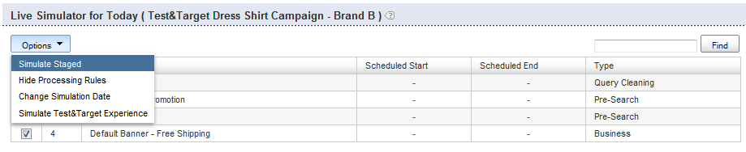

# About Business Rules{#about-business-rules}

You can use Business Rules to merchandise your search.

## Using Business Rules {#concept_2A93D76216754D3D8412CDEA00BD26BD} 

For example, you can configure when banners appear, or what results appear and in what order. You can also configure the position of an item in your facet, and what template is used for a given search. The rules run in the order they were defined; the higher a rule's order number, the later it runs in the process, trumping earlier rules. You can drag-and-drop the rules to change their order, or you can reorder them by entering a new number in the rules order text box.

Each business rule is made up of triggers and actions.

The trigger defines when the rule runs. For example, when the query term is "mens" or when the results are mostly hats. The trigger consists of multiple conditions that have to be either all, or any of them be true to make the overall trigger be true. You can specify the precedence by changing the trigger operator.

The action defines what happens when the trigger condition is met. For example, setting the banner to display or moving a given result to position 1. The table of rules shows summary information about the rule. You can click a rule name to open it and see additional information.

The table of rules shows a list of all your business rules. By default, the table shows the last ten rules that were added, in descending order. You can click the column headers in the table to sort the rules in ascending or descending order.

Business rules can have one of three states: Approved, Suspended, or WIP (Work In Progress) 

<table> 
 <thead> 
  <tr> 
   <th colname="col1" class="entry"> 
State of the business rule 
 </th> 
   <th colname="col2" class="entry"> 
Description 
 </th> 
  </tr> 
 </thead>
 <tbody> 
  <tr> 
   <td colname="col1"> 
Approved 
 </td> 
   <td colname="col2"> 
Approved business rules run in your live environment and in your staged environment. You approve a business rule in the Advanced Rule Builder. 
 </td> 
  </tr> 
  <tr> 
   <td colname="col1"> 
Suspended 
 </td> 
   <td colname="col2"> 
Suspended business rules never run in your staged environment or your live environment. 
 </td> 
  </tr> 
  <tr> 
   <td colname="col1"> 
WIP 
 </td> 
   <td colname="col2"> 
WIP (Work In Progress) are business rules that are neither approved nor suspended. That is, you may still be working on them or you may want to test them first before approving them. Business rules in a state of WIP run only in your staged environment. 
 </td> 
  </tr> 
 </tbody> 
</table>

You approve business rules and push them live so that they run in your live environment. Currently, you can only push *all* rules live. However, you can change a rule's status to have control over which rules run and do not run in your live environment.

By default rules run whenever their associated triggers are met. However, you can optionally schedule a rule to run for a specific date and time range.

Also, by default, rules run whenever their associate triggers are met for all stores. If you want the rule to only apply for certain stores then you can use the Stores panel to select one or more stores that the rule is applied to. 

## Adding a new business rule {#task_BD3B31ED48BB4B1B8F1DCD3BFA2528E7}

You can use [!DNL Visual Rule Builder] or [!DNL Advanced Rule Builder] to add business rules that tailor your customer's search experience.

**To add a new business rule**

The following steps assume you are using the Visual Rule Builder. 

1. Do one of the following:

    * On the product menu, click **[!UICONTROL Rules]** > **[!UICONTROL Business Rules]**. On the [!DNL Business Rules] page, click **[!UICONTROL Add New Rule]**. 
    
    * On the product menu, click **[!UICONTROL Simulator]**. On the **[!UICONTROL Simulator for Today]** page, click **[!UICONTROL Add New Rule]** to the right of the **[!UICONTROL Options]** drop-down menu.

      If the **[!UICONTROL Add New Rule]** option is not visible on the page, on the **[!UICONTROL Options]** drop-down menu, click **[!UICONTROL Simulate Staged]**. 
    
      

1. In the **[!UICONTROL Name]** text field, type the new name of the business rule.

   Do not click **[!UICONTROL Save Rule]** yet. 
1. (Optional) If you manage a large number of business rules, you can tag business rules with specific labels. In the **[!UICONTROL Tags]** field, enter one or more tag labels, Use a comma, Tab, or Enter as a delimiter.

   On the [!DNL Business Rules] page, use the **[!UICONTROL Filter by tag]** feature to filter for rules that match a given label. 1. On the [!DNL Business Rule Builder] page, set the triggers and actions that you want to use.

   **Trigger options**

   Triggers are the conditions that must be met for a business rule to run. When a business rule has multiple triggers, you can configure how triggers respond using one of the following three methods:

    * A response where all of the triggers must be true (the default setting) as in the following example:

      `if a AND b AND c then ...` 
    
    * A response where any of the triggers must be true as in the following example:

      `if a OR b OR c then ...` 
    
    * A response where a custom combination of triggers is specified. That is, you combine individual triggers or "conditions" with `AND` operators and `OR` operators.

      You can also alter the evaluation precedence by adding left- and right-parenthesis combinations as in the following example:

      `if (a OR b) AND c then ...`

      >[!NOTE]
      >
      >If you combine `AND` operators with `OR` operators in a Custom business rule set, be sure that you specify parentheses appropriately to ensure that the triggers are evaluated in the correct order.

      This particular feature of being able to customize a combination of triggers is not enabled by default. Contact Technical Support to activate this feature for your use.

    <table> 
      <thead> 
      <tr> 
      <th colname="col1" class="entry"> 
Triggers option 
 </th> 
      <th colname="col2" class="entry"> 
Description 
 </th> 
      </tr> 
    </thead>
    <tbody> 
      <tr> 
      <td colname="col1"> 
Keyword Matches 
 </td> 
      <td colname="col2"> 
Trigger is true when the search term matches the given case-sensitive keyword. The trigger is true for both the keyword and all of its synonyms, as defined in the Linguistics dictionary. 
 </td> 
      </tr> 
      <tr> 
      <td colname="col1"> 
 Query Matches 
 </td> 
      <td colname="col2"> 
 Trigger is true when all the search parameters match. 
 </td> 
      </tr> 
      <tr> 
      <td colname="col1"> 
 Result Group is Dominant 
 </td> 
      <td colname="col2"> 
 Trigger is true when the group of results defined by the given search dominates the result set. 
 
By default, dominance is set at 50%. This setting is a merchandising preference that you can set. 
 
 
        <!--See <xref href="t_Configuring_Merchandising_preferences.xml#task_7AC7B9F5D9F44E10AB5BC0B8CB31C37A" type="task" format="dita" scope="local">Configuring Merchandising preferences</xref>. --> 
 
The entire group must be present within the result set for this trigger to be true. The group of results is dynamic. They can change after index operations, depending on what results match the original search criteria. 
 </td> 
      </tr> 
      <tr> 
      <td colname="col1"> 
Result Group is Present 
 </td> 
      <td colname="col2"> 
 Trigger is true when the group of results defined by the given search is present in the result set. The entire group must be present within the result set for this trigger to be met (the results can present on any page). The group of results is dynamic and may change after index operations dependent on what results match the original search criteria. 
 </td> 
      </tr> 
      <tr> 
      <td colname="col1"> 
 Result Present 
 </td> 
      <td colname="col2"> 
 Trigger is true when the individual result is found within the result set. The result can be anywhere in the result set, it does not have to be on the page the user is currently viewing. 
 </td> 
      </tr> 
    </tbody> 
    </table>

   **Action options**

   When a business rule's triggers are met, the actions that are associated with the rule are performed. While Visual Rule Builder lets you create the following actions, you can use Advanced Rule Builder to create additional types of actions.

   The Remove Facet Item, Reveal Facet Item, Reveal Facet, Remove Facet, Push Facet Item actions in the following table require a facet. The interface for choosing a facet depends on how your account is configured. For example, a normal account uses a drop-down list for choosing facets. However, if your account has slotted facets, an autocomplete text box appears where you can enter the name of any facet. The autocomplete suggests facets in a drop-down list as you type the name of the facet. The suggestions include currently defined facets. If your account has a slot map, it also suggests slotted facets. 

    <table> 
    <thead> 
      <tr> 
      <th colname="col1" class="entry"> 
Actions option 
 </th> 
      <th colname="col2" class="entry"> 
Description 
 </th> 
      </tr> 
    </thead>
    <tbody> 
      <tr> 
      <td colname="col1"> 
Push Group 
 </td> 
      <td colname="col2"> 
 Pushes the group of search results as defined by the specified search criteria to a specific position. 
 
Pushing a group of search results does not implicitly add the group. 
 </td> 
      </tr> 
      <tr> 
      <td colname="col1"> 
Add Group 
 </td> 
      <td colname="col2"> 
 Add the group of search results as defined by the specified search criteria. 
 </td> 
      </tr> 
      <tr> 
      <td colname="col1"> 
Remove Group 
 </td> 
      <td colname="col2"> 
 Remove the group of search results defined by the specified search criteria. 
 </td> 
      </tr> 
      <tr> 
      <td colname="col1"> 
Push Single 
 </td> 
      <td colname="col2"> 
 Pushes the individual search result to the selected position. 
 </td> 
      </tr> 
      <tr> 
      <td colname="col1"> 
Add Single 
 </td> 
      <td colname="col2"> 
 Adds an individual search result to the selected position. 
 </td> 
      </tr> 
      <tr> 
      <td colname="col1"> 
Remove Single 
 </td> 
      <td colname="col2"> 
 Removes an individual search result from the search result set. 
 </td> 
      </tr> 
      <tr> 
      <td colname="col1"> 
Remove All Results 
 </td> 
      <td colname="col2"> 
Removes all results from the search result set. 
 
 
        <!-- Bug #3331637 The option is meant to be used in conjunction with other rule actions in order to create "canned landing pages" where we want to create a page's content solely by rule actions, and need to completely discard the "natural" results of the search. Given that the other options don't have any kind of "here's how/why you might use this", I don't see much point in breaking that precedent here.--> 
 </td> 
      </tr> 
      <tr> 
      <td colname="col1"> 
Select different banner 
 </td> 
      <td colname="col2"> 
 Changes the banner in the selected banner area. 
 
This option is available when you right-click on a banner in the web page viewing area. 
 </td> 
      </tr> 
      <tr> 
      <td colname="col1"> 
Add banner commands 
 </td> 
      <td colname="col2"> 
Applies to Adobe Dynamic Media Classic templates only. 
 
Lets you change the default parameters that are used in the banner template. 
 
See the table of options in <a scope="local" href="../c-about-design-menu/c-about-banners.md#task_AD1E0C00A9E04B1FA819EB93288786B3" type="reference" format="dita"> Adding a banner using Adobe Dynamic Media Classic </a>. 
 
See also <a href="../c-about-design-menu/c-about-banners.md#task_C3E782477FBF428ABEA220751781ACA9" type="task" format="dita" scope="local"> Editing a banner using Adobe Dynamic Media Classic </a>. 
 </td> 
      </tr> 
      <tr> 
      <td colname="col1"> 
Remove banner 
 </td> 
      <td colname="col2"> 
 Removes the banner from the selected banner area; no banner is displayed unless another rule that sets a banner, overrides this rule. 
 
This option is available when you right-click on a banner in the web page viewing area. 
 </td> 
      </tr> 
      <tr> 
      <td colname="col1"> 
Push Facet Item 
 </td> 
      <td colname="col2"> 
 Pushes an item within a facet to the selected position. 
 </td> 
      </tr> 
      <tr> 
      <td colname="col1"> 
Remove Zone 
 </td> 
      <td colname="col2"> 
 Removes a zone from the search results page. 
 
See also the Remove Facet action below. 
 </td> 
      </tr> 
      <tr> 
      <td colname="col1"> 
Reveal Zone 
 </td> 
      <td colname="col2"> 
 Reveals a zone in the search results page. 
 
See also the Reveal Facet action below. 
 </td> 
      </tr> 
      <tr> 
      <td colname="col1"> 
Remove Facet Item 
 </td> 
      <td colname="col2"> 
 Removes a facet item from a facet. 
 </td> 
      </tr> 
      <tr> 
      <td colname="col1"> 
Reveal Facet Item 
 </td> 
      <td colname="col2"> 
 Reveals a specific facet item. 
 </td> 
      </tr> 
      <tr> 
      <td colname="col1"> 
Reveal Facet 
 </td> 
      <td colname="col2"> 
 Reveals a specific facet. This action is preferred over the Reveal Zone action. 
 </td> 
      </tr> 
      <tr> 
      <td colname="col1"> 
Remove Facet 
 </td> 
      <td colname="col2"> 
 Removes a specific facet. This action is preferred over the Remove Zone action. 
 </td> 
      </tr> 
    </tbody> 
    </table>

    Depending on the rule builder panel that is active (unfolded), you can also do the following to set triggers and actions.

    * When the **[!UICONTROL Triggers]** panel is unfolded - In the presentation template area of the Business Rule Builder page, right-click on any search result or search facet, and then click **[!UICONTROL Add "result present" trigger]**.

      In the Triggers panel click the "X" to the left of a trigger to remove it from the list of triggers.

    * When the **[!UICONTROL Actions]** panel is unfolded - In the presentation template area of the Business Rule Builder page, right-click on a search result. Click **[!UICONTROL Add Result]**, **[!UICONTROL Remove Result]**, **[!UICONTROL Push to bottom]**, or **[!UICONTROL Push to #`<n>`]** (where `<n>` is a numeral).

1. (Optional) In any Business Rule Builder panel ( [!DNL Triggers], [!DNL Actions], or [!DNL Schedule]), do one of the following:

    * In the presentation template area of the Business Rule Builder page area, right-click a banner, and then click **[!UICONTROL Select different banner]**. On the **[!UICONTROL Pick Banner]** page, click **[!UICONTROL Pick this banner]** below the banner thumbnail to add it to your presentation template. Only banners that match the size and area of the original banner on the presentation template are available for you to pick.

      The add banner action is added to the [!DNL Actions] panel.

    * In the presentation template area of the [!DNL Business Rule Builder] page, right-click on an Adobe Dynamic Media Classic template banner whose parameters you want to change, and then click **[!UICONTROL Add banner commands]**. In the [!DNL Change Parameters] dialog box, set the parameter options that you want.

      See the table of options in [Adding a banner using Adobe Dynamic Media Classic](../c-about-design-menu/c-about-banners.md#task_AD1E0C00A9E04B1FA819EB93288786B3).

      Click **[!UICONTROL Save]**.

      The parameter changes are added to the [!DNL Actions] panel.

      See also [Editing a banner using Adobe Dynamic Media Classic](../c-about-design-menu/c-about-banners.md#task_C3E782477FBF428ABEA220751781ACA9). 
    
    * In the presentation template area of the Business Rule Builder page, right-click on a banner that you want to delete from the page, and then click **[!UICONTROL Remove banner]**. The remove banner action is added to the Actions panel.

1. (Optional) In the **[!UICONTROL Schedule]** panel, do one of the following:

    * Click **[!UICONTROL Run Indefinitely]** to have the rule run whenever its associated triggers are met. This option is the default. 
    * Click **[!UICONTROL Fixed Schedule]**, and then specify the start date and time, and the end date and time for the rule to run whenever its associated trigger is met.

1. Click **[!UICONTROL Save Rule]**.
1. (Optional) On the [!DNL Business Rules] page, do one of the following:

    * Click **[!UICONTROL History]** to revert any changes that you have made.

      See [Using the History option](../t-using-the-history-option.md#task_70DD3F87A67242BBBD2CB27156F43002). 
    
    * Click **[!UICONTROL Live]**.

      See [Viewing live settings](../c-about-staging.md#task_401A0EBDB5DB4D4CA933CBA7BECDC10F). 
    
    * Click **[!UICONTROL Push Live]**.

      See [Pushing stage settings live](../c-about-staging.md#task_44306783B4C0408AAA58B471DAF2D9A4).

## Editing a business rule {#task_375CFA75D1D94D9E92A35DE1228E5087}

You can use Visual Rule Builder or Advanced Rule Builder to edit business rules that you have added.

**To edit a new business rule** 

1. On the product menu, click **[!UICONTROL Rules]** > **[!UICONTROL Business Rules]**.
1. On the [!DNL Business Rules] page, do one of the following:

    * Under the [!DNL Name] column, click the name of a business rule that you want to change.

      The business rule is opened in the default interface that is specified in **[!UICONTROL Settings]** > **[!UICONTROL My Profile]** > **[!UICONTROL My Preferences]**. 
    
    * In the drop-down list, next to a business rule name that you want to edit, click **[!UICONTROL Edit in advanced mode]** or **[!UICONTROL Edit in visual mode]**.

1. In the [!DNL Name] text field, type the new name of the business rule.

   Do not click **[!UICONTROL Save Rule]** yet. 1. On the [!DNL Business Rule Builder] page, set the triggers and actions that you want to use.

   See the table of options under [Adding a new business rule](../c-about-rules-menu/c-about-business-rules.md#task_BD3B31ED48BB4B1B8F1DCD3BFA2528E7). 
1. (Optional) In any **[!UICONTROL Business Rule Builder]** panel ( [!DNL Triggers], [!DNL Actions], or [!DNL Schedule], do any of the following:

    * In the presentation template area of the [!DNL Business Rule Builder] page, right-click a banner, and then click **[!UICONTROL Select different banner]**. On the [!DNL Pick Banner page], click **[!UICONTROL Pick this banner]** below the banner thumbnail to add it to your presentation template. Only banners that match the size and area of the original banner on the presentation template are available for you to pick.

      The add banner action is added to the [!DNL Actions] panel. 
    
    * In the presentation template area of the [!DNL Business Rule Builder] page, right-click on an Adobe Dynamic Media Classic template banner whose parameters you want to change, and then click **[!UICONTROL Add banner commands]**. In the [!DNL Change Parameters] dialog box, set the parameter options that you want.

      See the table of options in [Adding a banner using Adobe Dynamic Media Classic](../c-about-design-menu/c-about-banners.md#task_AD1E0C00A9E04B1FA819EB93288786B3).

      Click **[!UICONTROL Save]**.

      The parameter changes are added to the [!DNL Actions] panel.

      See also [Editing a banner using Adobe Dynamic Media Classic](../c-about-design-menu/c-about-banners.md#task_C3E782477FBF428ABEA220751781ACA9). 
    
    * In the presentation template area of the [!DNL Business Rule Builder] page, right-click on a banner that you want to delete from the page, and then click **[!UICONTROL Remove banner]**. The remove banner action is added to the [!DNL Actions] panel.

1. (Optional) In the [!DNL Schedule] panel, do one of the following:

    * Click **[!UICONTROL Run Indefinitely]** to have the rule run whenever its associated triggers are met. This option is the default. 
    * Click **[!UICONTROL Fixed Schedule]**, and then specify the start date and time, and the end date and time for the rule to run whenever its associated trigger are met.

1. Click **[!UICONTROL Save Rule]**.

   The [!DNL Business Rule Builder] page closes, and you are returned to the **[!UICONTROL Business Rule]** page. Your rules appear in the table. Click the **[!UICONTROL Modified]** column header to sort the rules by edit date. 1. (Optional) Do one of the following:

    * Click **[!UICONTROL History]** to revert any changes that you have made.

      See [Using the History option](../t-using-the-history-option.md#task_70DD3F87A67242BBBD2CB27156F43002). 
    
    * Click **[!UICONTROL Live]**.

      See [Viewing live settings](../c-about-staging.md#task_401A0EBDB5DB4D4CA933CBA7BECDC10F). 
    
    * Click **[!UICONTROL Push Live]**.

      See [Pushing stage settings live](../c-about-staging.md#task_44306783B4C0408AAA58B471DAF2D9A4).

## Copying a business rule {#task_89F1879C71A54EE9B7454439302C03EC}

You can copy an existing business rule to use as the basis for a new business rule that you want to create.

**To copy a business rule** 

1. On the product menu, click **[!UICONTROL Rules]** > **[!UICONTROL Business Rules]**.
1. On the **[!UICONTROL Business Rules]** page, in the drop-down list next to a business rule name that you want to copy, click **[!UICONTROL Copy rule]**.
1. Edit the copied business rule as usual.

   See [Editing a business rule](../c-about-rules-menu/c-about-business-rules.md#task_375CFA75D1D94D9E92A35DE1228E5087). 

## Approving business rules {#task_BD569D18BF664272B8692294C162E2C1}

You can activate business rules that have either a status of WIP (Work In Progress) or suspended.

**To approve business rules** 

1. On the product menu, click **[!UICONTROL Rule]** > **[!UICONTROL Business Rules]**.
1. On the [!DNL Business Rules] page, using the status column header in the [!DNL Status] column of the business rules table, sort the rules that have a status of **[!UICONTROL WIP]** or **[!UICONTROL suspended]**.

   Use the check box column header on the left side of the table to check all the rules that are currently displayed on the page or check only those that have a status of **[!UICONTROL WIP]** or **[!UICONTROL suspended]**. 1. On the menu bar near the top of the page, click **[!UICONTROL Approve]**.
1. In the **[!UICONTROL Confirm Action]** dialog box, click **[!UICONTROL OK]**.
1. (Optional) Do one of the following:

    * Click **[!UICONTROL History]** to revert any changes that you have made.

      See [Using the History option](../t-using-the-history-option.md#task_70DD3F87A67242BBBD2CB27156F43002). 
    
    * Click **[!UICONTROL Live]**.

      See [Viewing live settings](../c-about-staging.md#task_401A0EBDB5DB4D4CA933CBA7BECDC10F). 
    
    * Click **[!UICONTROL Push Live]**.

      See [Pushing stage settings live](../c-about-staging.md#task_44306783B4C0408AAA58B471DAF2D9A4).

## Suspending business rules {#task_364E1FFB905141C08E306C8F1794A20E}

You can suspend business rules that have either a status of WIP (Work In Progress) or approved.

When you suspended a rule you are indicating in the user interface that you have temporarily made it inactive and you are deferring any work on it for another time. You can, however, still edit a suspended rule.

**To suspend business rules** 

1. On the product menu, click **[!UICONTROL Rule]** > **[!UICONTROL Business Rules]**.
1. On the [!DNL Business Rules] page, using the status in the Status column of the business rules table, in the far left column of the table, check the rules that have a status of **[!UICONTROL WIP]**, or **[!UICONTROL approved]**.
1. On the menu bar near the top of the page, click **[!UICONTROL Suspend]**.
1. In the **[!UICONTROL Confirm Action]** dialog box, click **[!UICONTROL OK]**.
1. (Optional) Do one of the following:

    * Click **[!UICONTROL History]** to revert any changes that you have made.

      See [Using the History option](../t-using-the-history-option.md#task_70DD3F87A67242BBBD2CB27156F43002). 
    
    * Click **[!UICONTROL Live]**.

      See [Viewing live settings](../c-about-staging.md#task_401A0EBDB5DB4D4CA933CBA7BECDC10F). 
    
    * Click **[!UICONTROL Push Live]**.

      See [Pushing stage settings live](../c-about-staging.md#task_44306783B4C0408AAA58B471DAF2D9A4).

## Resume business rules {#task_E67D678C765B436EA2A3D6ADD7A49ABA}

You can resume business rules to reactivate a suspended rule. After you resume the business rule, its status is set to WIP (Work In Progress).

**To resume business rules** 

1. On the product menu, click **[!UICONTROL Rule]** > **[!UICONTROL Business Rules]**.
1. On the [!DNL Business Rules] page, using the status in the Status column of the business rules table, in the far left column of the table, check the rules that have a status of **[!UICONTROL suspended]**.
1. On the menu bar near the top of the page, click **[!UICONTROL Resume]**.
1. In the [!DNL Confirm Action] dialog box, click **[!UICONTROL OK]**.
1. (Optional) Do one of the following:

    * Click **[!UICONTROL History]** to revert any changes that you have made.

      See [Using the History option](../t-using-the-history-option.md#task_70DD3F87A67242BBBD2CB27156F43002). 
    
    * Click **[!UICONTROL Live]**.

      See [Viewing live settings](../c-about-staging.md#task_401A0EBDB5DB4D4CA933CBA7BECDC10F). 
    
    * Click **[!UICONTROL Push Live]**.

      See [Pushing stage settings live](../c-about-staging.md#task_44306783B4C0408AAA58B471DAF2D9A4).

## Changing the order that business rules run {#task_FE3B1C17307F49B49050C2EC5A063991}

You can reorder business rules to change the order in which they run on presentation templates.

Business rules run in the order that they were defined; the higher a rule's order number, the later it runs in the process, trumping earlier rules. You reorder rules by entering a new number in the Order column of the table on the [!DNL Business Rules] page. You can also use drag-and-drop on rules to change their run order.

**To change the order that business rules run** 

1. On the product menu, click **[!UICONTROL Rule]** > **[!UICONTROL Business Rules]**.
1. On the [!DNL Business Rules] page, in the table, do any one of the following:

    * Click the **[!UICONTROL Order]** column header to sort the rules in ascending or descending order. 
    * In the **[!UICONTROL Order]** column, in the text field to the left of a business rule name, type the order number that you want the rule to run. 
    * Drag-and-drop a table row to the position that you want the rule to run. All the order numbers are updated to reflect the new order in which the rules run.

1. Click **[!UICONTROL Save Changes]**.

   Your business rules will now run in the order that you specified. The exception is if there is a redirect business rule specified. If and when the redirect business rule is triggered or hit, business rule processing stops to allow for the redirect. 
1. (Optional) Do one of the following:

    * Click **[!UICONTROL History]** to revert any changes that you have made.

      See [Using the History option](../t-using-the-history-option.md#task_70DD3F87A67242BBBD2CB27156F43002). 
    
    * Click **[!UICONTROL Live]**.

      See [Viewing live settings](../c-about-staging.md#task_401A0EBDB5DB4D4CA933CBA7BECDC10F). 
    
    * Click **[!UICONTROL Push Live]**.

      See [Pushing stage settings live](../c-about-staging.md#task_44306783B4C0408AAA58B471DAF2D9A4).

## Deleting business rules {#task_AE37B42412044541BCC6D46CF8793DFF}

You can delete business rules whose status is WIP, suspended, or approved, by using the Bulk Actions drop-down menu.

**To delete business rules** 

1. On the product menu, click **[!UICONTROL Rules]** > **[!UICONTROL Business Rules]**.
1. On the [!DNL Business Rules] page, do one of the following:

    * Use the check box column header to check all the rules that are currently displayed on the page. 
    * Check only those business rules that you want to delete, based on the status in the Status column of the table.

1. On the [!DNL Bulk Actions] drop-down list, click **[!UICONTROL Delete]**.
1. In the [!DNL Confirm Action] dialog box, click **[!UICONTROL OK]**.
1. (Optional) Do one of the following:

    * Click **[!UICONTROL History]** to revert any changes that you have made.

      See [Using the History option](../t-using-the-history-option.md#task_70DD3F87A67242BBBD2CB27156F43002). 
    
    * Click **[!UICONTROL Live]**.

      See [Viewing live settings](../c-about-staging.md#task_401A0EBDB5DB4D4CA933CBA7BECDC10F). 
    
    * Click **[!UICONTROL Push Live]**.

      See [Pushing stage settings live](../c-about-staging.md#task_44306783B4C0408AAA58B471DAF2D9A4).
