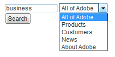
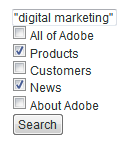
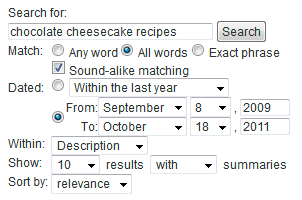

# Search forms{#search-forms}

## Using collections in search forms {#reference_5A079AEEEFB84457892EF0870D0605C3}

Collections let your customers search specific areas of your website. Depending on whether you implement a drop-down list or a list of check boxes, you can let your customers search a single collection or multiple collections.

See also [About Collections](../c-about-settings-menu/c-about-searching-menu.md#concept_62E42ACE53D54EEE9273433B86259127).

The following example shows four different collection names and the associated areas of the website that they cover:

<table> 
 <thead> 
  <tr> 
   <th colname="col1" class="entry"> <p>Collection name </p> </th> 
   <th colname="col2" class="entry"> <p> </p> </th> 
  </tr> 
 </thead>
 <tbody> 
  <tr> 
   <td colname="col1"> <p>Products </p> </td> 
   <td colname="col2"> <p> 
     <ul id="ul_7AE70789C0914EBFBCCC7695C6F53B9E"> 
      <li id="li_72525BAA34E2442D86152F2FD8CA83D5"> https://www.mycompany.com/products.htm </li> 
      <li id="li_5CA4152239124BDBB251E6C94B15D45B"> https://www.mycompany.com/publish/ </li> 
      <li id="li_6E266736B3494696A3AFD841C4AFEC57"> https://www.mycompany.com/search/ </li> 
     </ul> </p> </td> 
  </tr> 
  <tr> 
   <td colname="col1"> <p>Customers </p> </td> 
   <td colname="col2"> <p>https://www.mycompany.com/customers/ </p> </td> 
  </tr> 
  <tr> 
   <td colname="col1"> <p>News </p> </td> 
   <td colname="col2"> <p>https://www.mycompany.com/news/ </p> </td> 
  </tr> 
  <tr> 
   <td colname="col1"> <p>About Adobe </p> </td> 
   <td colname="col2"> <p>https://www.mycompany.com/company/ </p> </td> 
  </tr> 
 </tbody> 
</table>

The drop-down search form interface lets users select one collection and looks like the following:



The drop-down search form is generated with the following HTML code:

```
<select name="sp_k"> 
<option value="">All of Adobe</option> 
<option value="Products">Products</option> 
<option value="Customers">Customers</option> 
<option value="News">News</option> 
<option value="About Adobe">About Adobe</option> 
</select>
```

Alternately, you could use a group of check boxes in your search form so that visitors can select multiple collections:



The check box search form is generated with the following HTML code:

```
<input type="checkbox" name="sp_k" value="">All of Adobe<br> 
<input type="checkbox" name="sp_k" value="Products">Products<br> 
<input type="checkbox" name="sp_k" value="Customers">Customers<br> 
<input type="checkbox" name="sp_k" value="News">News<br> 
<input type="checkbox" name="sp_k" value="About Adobe">About Adobe<br>
```

## Search results {#section_BBDD5B44E2B349BC88D937F44583D350}

The search template tag `<search-input-collections>` generates the collection list box HTML in the search results and automatically selects the collection that is specified in the search. If you want to generate check boxes instead, use the `<search-input>` tag instead of the `<input>` tag as follows: 

```
<search-input type="checkbox" name="sp_k" value="">All of Adobe<br> 
<search-input type="checkbox" name="sp_k" value="Products">Products<br> 
<search-input type="checkbox" name="sp_k" value="Customers">Customers<br> 
<search-input type="checkbox" name="sp_k" value="News">News<br> 
<search-input type="checkbox" name="sp_k" value="About Adobe">About Adobe<br>
```

The `<search-input>` tag outputs an `<input>` tag and includes the `checked` attribute if the collection was specified in the search. 

## Using frames with forms {#reference_82CDDDA1E37042E4849EBF7EA05407C5}

You can configure your framesets to work with site search/merchandising.

To learn more about HTML frames and the HTML frameset element, see the following URL:

[https://www.w3schools.com/html/html_frames.asp](https://www.w3schools.com/html/html_frames.asp)

If your site uses frames, you can specify a target frame for search result links. The default target is _self, which opens links in the current frame or browser window. You can, instead, specify site-specific or browser-reserved targets:

* _top (browser-reserved) results open in the current browser window and replace all current frames. 
* _blank (browser-reserved) results open in a new browser window. 
* _parent (browser-reserved) results open in the current frame's parent frame. 
* frame2 (site-specific) results open in a frame named "frame2". You can specify the name of any frame as a value (for example main or content).

If your site does not use frames, you most likely do not want to change the default target name.

If you create a custom search results template for your website, you can override the specified setting by using the `target` attribute of the `<search-link>` tag.

The process for configuring framesets is as follows:

<table> 
 <thead> 
  <tr> 
   <th colname="col1" class="entry"> <p>Process step </p> </th> 
   <th colname="col02" class="entry"> <p>Process description </p> </th> 
   <th colname="col2" class="entry"> <p>Link </p> </th> 
  </tr> 
 </thead>
 <tbody> 
  <tr> 
   <td colname="col1"> <p>1 </p> </td> 
   <td colname="col02"> <p>Add the form to the desired frame in your web page. </p> </td> 
   <td colname="col2"> <p> <a href="#section_BAA8A502BB2243F8B5FF9783CDF2BFFD" type="section" format="dita" scope="local"> Adding the search form code to a frame in your... </a> </p> </td> 
  </tr> 
  <tr> 
   <td colname="col1"> <p>2 </p> </td> 
   <td colname="col02"> <p>Set the target frame for the search results page. </p> </td> 
   <td colname="col2"> <p> <a scope="local" href="#section_532CACB90888467093D95EACB64FDFA1" type="section" format="dita"> Setting the target frame for the search results page </a> </p> </td> 
  </tr> 
  <tr> 
   <td colname="col1"> <p>3 </p> </td> 
   <td colname="col02"> <p>Set the target for links made from the search results page. </p> </td> 
   <td colname="col2"> <p> <a scope="local" href="#section_523248C5AC424D878321C21A23A5CD66" type="section" format="dita"> Setting the target for links made from the search results... </a> </p> </td> 
  </tr> 
  <tr> 
   <td colname="col1"> <p>4 </p> </td> 
   <td colname="col02"> <p>Edit the navigation frame pages to prevent them from being indexed. </p> </td> 
   <td colname="col2"> <p> <a scope="local" href="#section_C62E5F0EE1294D5EBD97E123E54433FC" type="section" format="dita"> Editing the navigation frame pages to prevent them from being... </a> </p> </td> 
  </tr> 
  <tr> 
   <td colname="col1"> <p>5 </p> </td> 
   <td colname="col02"> <p>Test the search form. </p> </td> 
   <td colname="col2"> <p> <a scope="local" href="#section_43D8D4A7BF524DC480DFE5442F6A2E3C" type="section" format="dita"> Testing the search form </a> </p> </td> 
  </tr> 
 </tbody> 
</table>

## Adding the search form code to a frame in your web page {#section_BAA8A502BB2243F8B5FF9783CDF2BFFD}

1. On the product menu, click **[!UICONTROL Design]** > **[!UICONTROL Auto-Complete]** > **[!UICONTROL Form Source]**.

   The HTML search form code looks similar to the following:

   ```
   <!-- Adobe Target HTML for [your customer name] --> 
   <form method="get" action="https://search.atomz.com/search/"> 
   <input size=15 name="sp_q"><br> 
   <input type=submit value="Search"> 
   <input type=hidden name="sp_a" value="[your account number]"> 
   </form>
   ```

1. On the [!DNL Standard Form Source] page, select and copy the HTML search form code that appears in the text field. 
1. Paste the search form code into the frame you want in your frameset.

   In the below example, the search form code is pasted into the navigation frame--the narrow vertical frame on the left-hand side of the screen.

   

## Setting the target frame for the search results page {#section_532CACB90888467093D95EACB64FDFA1}

If you placed your search form code into the vertical navigation frame as above, you can display the search results in the larger, main frame. In this example, you call the main frame "body" and set it as the target frame.


1. To specify the target frame for the results page, add a target and value to the form by changing the following line in the search form code from the following:

   `<form method="get" action="https://search.atomz.com/search/">`

   to the following:

   `<form target="body" method="get" action="https://search.atomz.com/search/">`

   Be sure that you put quotes around the form target value.

When a customer performs a search of your website, the search results appear in the "body" frame of the web page.

## Setting the target for links made from the search results page {#section_523248C5AC424D878321C21A23A5CD66}

You can set the destination frame by directly editing your template.

If your search results appear in the "body" frame, you probably want the links to open in the "body" frame, too. Because this is the same frame, the target value `"_self"` which is the default setting, you do not need to make any changes.

You can also set the destination frame for results links. The following are several examples of what you can do:

* Specify different frames for the search results and their links so that the search results remain active in their own frame while each clicked result opens in a separate frame. 
* Specify that the search results open into a new blank window, so that your old window remains active with its original contents, which also preserves the search results.

The target name can either be the name of a frame that is specified in your HTML or it can be one of several of the following HTML defaults:

* `target="_blank"` Open links in a new, blank, unnamed window. 

* `target="_self"` Default. Open links in the same window where the search results reside. In this case, the original search results window. Use this option to override a globally assigned base target. 

* `target="_parent"` Open links in the parent frameset of the link page . If the document has no parent, then this functions like `"_self"` by default. 

* `target="_top"` Open links in the full window. If the document is already at the top, then this functions like `"_self"` by default. Use this option to break out of an arbitrarily deep frame nesting.

For example, to set the `_blank` target destination frame you can edit the template in the following manner:

1. On the product menu, click **[!UICONTROL Design]** > **[!UICONTROL Templates]**. 

1. On the [!DNL Staged Templates] page, in the table, click the name of template with the targeted destination frame. 
1. Locate the `<search-link>` tag. Your default `<search-link>` tag should look similar to the following:

   `<search-link><search-title length=100></search-link>` 

1. Add the frame target to the `<search-link>` tag. In the example above, enter `target="_blank"`. Be sure that you include the underscore and the quotes around the target value.

   The `<search-link>` tag now appears like the following:

   `<search-link target="_blank"><search-title length=100></search-link>`

When a site visitor chooses a search results link, the linked page now opens into a new, blank window.

## Editing the navigation frame pages to prevent them from being indexed {#section_C62E5F0EE1294D5EBD97E123E54433FC}

Typically, you want to exclude your navigation frames from being indexed with your search results. To accomplish this functionality, you can add `noindex` meta tag to those pages.

1. Open the HTML page source for your navigation frame. 
1. Add the following meta tag inside the `<head>` section of your HTML:

   `<meta name="robots" content="noindex">`

   For example:

   ```
   <html> 
   <head> 
   <title>This page is a frameset that I do not want indexed</title> 
   <meta http-equiv="Content-Type" content="text/html; charset=iso-8859-1"> 
   <meta name="robots" content="noindex"> 
   </head>
   ```

## Testing the search form {#section_43D8D4A7BF524DC480DFE5442F6A2E3C}

1. Go to your website and navigate to a form. 
1. In the search field, enter a few search terms, and then click **[!UICONTROL Search]**.

   The following is true:

    * The search results page appears in the specified target frame. 
    * Links from your search results are in the specified target frame. 
    * Navigation frame results do not appear.

   If you experience issues with frames after testing the search form, contact Customer Support.

## Sample advanced search form {#reference_82E1051918744EBA88A01E9E6AE42C4A}

You can edit the advanced form code to suit your design and content needs, or add or remove additional search parameters.

Your home page is a good place to insert an advanced search form because many customers expect to find search capability there. You can also create an HTML page that includes the search form and other helpful information, and then link to that page throughout your website.

If you are indexing secure content, you can have the search results served from secure Search Web servers. Change the URL in the search form action attribute to: action="https://search.atomz.com/search/" to do this.

>[!NOTE]
>
>Some HTML editors have trouble pasting HTML code from other applications. If the HTML code appears on your web page as text, copy and paste the search code into a simple text editor, such as Notepad on Windows or Simple Text on Mac, and then copy and paste again from the simple text editor to your HTML editor.

Search parameters are used in advanced search form code to create radio buttons, check boxes, and list boxes that customers can use to customize individual searches. Customers can specify the number of displayed search results, for example, or a date range, or whether summaries display with search results-all through options that appear on the advanced search forms.

Using the following sample advanced search form, the remainder of this topic shows you how each option on the form is created using search parameters.



You can view the entire advanced search form HTML code of the sample above.

See [Advanced search form HTML code](#reference_9AAD4A46B68D4D48865508982CB86DB9).

See [Configuring Auto-Complete CSS](../c-about-auto-complete.md#task_EECE35DEB6C94F4A8A5B42B4DED76D96).

See [Copying the HTML code of the search form into the...](../c-about-auto-complete.md#task_A3A01EA800F24C0AA33902387E0362C7).

<table> 
 <thead> 
  <tr> 
   <th colname="col2" class="entry"> <p>Location on form </p> </th> 
   <th colname="col1" class="entry"> <p>Parameter </p> </th> 
   <th colname="col3" class="entry"> <p>HTML code </p> </th> 
   <th colname="col4" class="entry"> <p>Description </p> </th> 
  </tr> 
 </thead>
 <tbody> 
  <tr> 
   <td colname="col2"> <p>Enable the advanced search form options (hidden field) </p> </td> 
   <td colname="col1"> <p> <span class="codeph"> sp_advanced </span> </p> </td> 
   <td colname="col3"> <p> <span class="syntax html codeph"> &lt;input type=hidden name="sp_advanced" value=1&gt; </span> </p> </td> 
   <td colname="col4"> <p>Enable or disable advanced search options. For example, you can put a standard search form on your home page with a link to a second page that contains an advanced form. In this case, you would put a copy of your standard form inside <span class="codeph"> &lt;search-if-not-advanced&gt;...&lt;/search-if-not-advanced&gt; </span> template tags. </p> <p>A customer who performs a search from the standard form sees a standard search form when the search results are displayed. On the advanced search form screen, you include the <span class="codeph"> &lt;input type=hidden name="sp_advanced" value=1&gt; </span> tag with the other advanced form options. </p> <p>You also include a copy of the advanced search form inside the &lt;search-if-advanced&gt;... &lt;/search-if-advanced&gt; template tags. A customer who performs a search from your advanced search form sees an advanced search form when search results are displayed. </p> </td> 
  </tr> 
  <tr> 
   <td colname="col2"> <p> Match any, all, or phrase </p> </td> 
   <td colname="col1"> <p> <span class="codeph"> sp_p </span> </p> <p> </p> </td> 
   <td colname="col3"> <p> <code class="syntax html"> &lt;!--&nbsp;Allow&nbsp;"any,"&nbsp;"all,"&nbsp;or&nbsp;"phrase"&nbsp;--&gt; 
      &lt;input&nbsp;type=radio&nbsp;name="sp_p"&nbsp;value="any"&gt;Any&nbsp;word 
      &lt;input&nbsp;type=radio&nbsp;name="sp_p"&nbsp;value="all"&nbsp;checked&gt;All&nbsp;words 
      &lt;input&nbsp;type=radio&nbsp;name="sp_p"&nbsp;value="phrase"&gt;Exact&nbsp;phrase </code> </p> </td> 
   <td colname="col4"> <p>Allow your customer to specify that "any word," "all words," or "the exact phrase" must be present for a document to match. When the <span class="codeph"> sp_p </span> parameter is specified, customers do not need to use "+", or "-", or both in the search query. </p> <p> If the <span class="codeph"> sp_p </span> parameter is omitted, or if it is set to "" or "any," then customers can still use the "+" and "-" specifiers. If the <span class="codeph"> sp_p </span> parameter is set to "all" or "phrase," then specified "+" and "-" are ignored. </p> <p>You can learn more about using "+" and "-" in a search. </p> <p>See <a href="../c-about-settings-menu/c-about-searching-menu.md#concept_207105CF26B1448F8A3D223787C56AB8" type="concept" format="dita" scope="local"> About Searches </a>. </p> </td> 
  </tr> 
  <tr> 
   <td colname="col2"> <p> Sound-alike matching </p> </td> 
   <td colname="col1"> <p> <span class="codeph"> sp_w </span> </p> <p>and </p> <p> <span class="codeph"> sp_w_control </span> </p> <p> </p> </td> 
   <td colname="col3"> <p> <code class="syntax html"> &lt;!--&nbsp;Checkbox&nbsp;enables&nbsp;sound-alike&nbsp;matching&nbsp;--&gt; 
      &lt;input&nbsp;type=hidden&nbsp;name="sp_w_control"&nbsp;value=1&gt; 
      &lt;input&nbsp;type=checkbox&nbsp;name="sp_w"&nbsp;value="alike"&gt;&nbsp;Sound-alike&nbsp;matching </code> </p> </td> 
   <td colname="col4"> <p>Lets customers enable or disable sound-alike matching. Sound-alike matching allows misspelled search queries to match words that "sound alike" in your documents. </p> <p>When the <span class="codeph"> sp_w_control </span> parameter is set to 1 and the <span class="codeph"> sp_w </span> parameter is set to "alike," the generated check box is selected, enabling sound-alike matching by default. </p> <p>If the <span class="codeph"> sp_w </span> parameter is set to "", the check box is not selected. </p> <p>If you did not enable sound-alike matching during your most recent indexing operation, then sound-alike matching is not possible and the <span class="codeph"> sp_w </span> parameter is ignored. To enable sound-alike matching, on the product menu, click <span class="uicontrol"> Linguistics </span> &gt; <span class="uicontrol"> Words &amp; Language </span> &gt; <span class="uicontrol"> Sound-Alike Matching </span>. </p> <p>You can also assign the parameters <span class="codeph"> sp_w </span> and <span class="codeph"> sp_w_control </span> parameters in the following way: </p> <p> <code class="syntax html"> &lt;!--&nbsp;Checkbox&nbsp;disables&nbsp;sound-alike&nbsp;matching&nbsp;--&gt; 
      &lt;input&nbsp;type=hidden&nbsp;name="sp_w_control"&nbsp;value=0&gt; 
      &lt;input&nbsp;type=checkbox&nbsp;name="sp_w"&nbsp;value="exact"&gt; 
      No&nbsp;sound-alike&nbsp;matching </code> </p> <p>In this case, when the <span class="codeph"> sp_w_control </span> parameter is set to 0 and the <span class="codeph"> sp_w </span> parameter is set to "exact," sound-alike matching is disabled by default. If the <span class="codeph"> sp_w </span> parameter is set to "" then sound-alike matching is enabled. </p> </td> 
  </tr> 
  <tr> 
   <td colname="col2"> <p>Date range matching </p> </td> 
   <td colname="col1"> <p> <span class="codeph"> sp_d </span> </p> <p> </p> </td> 
   <td colname="col3"> <p> <code class="syntax html"> &lt;!--Specifies&nbsp;type&nbsp;of&nbsp;date&nbsp;range&nbsp;searching&nbsp;to&nbsp;perform.--&gt; 
      &lt;input&nbsp;type=radio&nbsp;name="sp_d"&nbsp;value="custom"&nbsp;checked&gt; 
      &lt;input&nbsp;type=radio&nbsp;name="sp_d"&nbsp;value="specific"&gt; </code> </p> </td> 
   <td colname="col4"> <p>The <span class="codeph"> sp_d </span> parameter specifies a custom data range matching to perform or a specific date range matching to perform. </p> <p>On the default advanced search form, this option is presented as a radio button group with a drop-down list of "custom" date ranges as generated with a <span class="codeph"> sp_date_range </span> parameter. It also includes and a group of "specific" start and end dates that are generated with <span class="codeph"> sp_start_day </span>, <span class="codeph"> sp_start_month </span>, <span class="codeph"> sp_start_year </span>, <span class="codeph"> sp_end_day </span>, <span class="codeph"> sp_end_month </span>, and <span class="codeph"> sp_end_year </span> parameters. </p> <p>A "custom" date range is a named range of dates to search. For example, "Anytime," "Today," "Within the last year," and so on. </p> <p>A "specific" date range consists of a start date and an end date. For example, from "September 8, 2009 to October 18, 2011." </p> </td> 
  </tr> 
  <tr> 
   <td colname="col2"> <p>Date range matching: custom date range </p> </td> 
   <td colname="col1"> <p> <span class="codeph"> sp_date_range </span> </p> <p> </p> </td> 
   <td colname="col3"> <p> <code class="syntax html"> &lt;!--Selection&nbsp;list&nbsp;for&nbsp;custom&nbsp;date&nbsp;range.--&gt; 
      &lt;select&nbsp;name="sp_date_range"&nbsp;size=1&gt; 
      &lt;option&nbsp;value=-1&nbsp;selected&gt;Anytime&lt;/option&gt; 
      &lt;option&nbsp;value=7&gt;Within&nbsp;the&nbsp;last&nbsp;week&lt;/option&gt; 
      &lt;option&nbsp;value=14&gt;Within&nbsp;the&nbsp;last&nbsp;2&nbsp;weeks&lt;/option&gt; 
      &lt;option&nbsp;value=30&gt;Within&nbsp;the&nbsp;last&nbsp;30&nbsp;days&lt;/option&gt; 
      &lt;option&nbsp;value=60&gt;Within&nbsp;the&nbsp;last&nbsp;60&nbsp;days&lt;/option&gt; 
      &lt;option&nbsp;value=90&gt;Within&nbsp;the&nbsp;last&nbsp;90&nbsp;days&lt;/option&gt; 
      &lt;option&nbsp;value=180&gt;Within&nbsp;the&nbsp;last&nbsp;180&nbsp;days&lt;/option&gt; 
      &lt;option&nbsp;value=365&gt;Within&nbsp;the&nbsp;last&nbsp;year&lt;/option&gt; 
      &lt;option&nbsp;value=730&gt;Within&nbsp;the&nbsp;last&nbsp;two&nbsp;years&lt;/option&gt; 
      &lt;/select&gt; </code> </p> </td> 
   <td colname="col4"> <p>The <span class="codeph"> sp_date_range </span> parameter is used to create a "custom" date range. For example, "Anytime," "Today," "Within the last year" and so on. </p> <p>Values greater than or equal to zero specify the number of days to search before today. For example, a value of 0 specifies "Today," a value of "1" specifies "Today and Yesterday," a value of "30" specifies "Within the Last 30 Days," and so on. Values less than zero specify a custom range as follows: </p> <p> 
     <ul id="ul_E65DDE33883F441F9730F315E485AD98"> 
      <li id="li_83E9466AB9D7438A8544001F6B007186"> <p>-1 = "Anytime," the same as specifying no date range. </p> </li> 
      <li id="li_38AB8D97179A47F9B860A96EA09119BB"> <p>-2 = "This week," which searches from Sunday to Saturday of the current week. </p> </li> 
      <li id="li_F4C3A8658428418A8A06FBAAB4733C68"> <p>-3 = "Last week," which searches from Sunday to Saturday of the week before the current week. </p> </li> 
      <li id="li_DF2D0B043A4E4DE9BE8D82E69A76E793"> <p>-4 = "This month," which searches dates within the current month. </p> </li> 
      <li id="li_76BC4C2CED574E2A81448158828BFF1B"> <p>-5 = "Last month," which searches dates within the month before the current month. </p> </li> 
      <li id="li_17FF849384FB46D58AF6FF1D3BC408C8"> <p>-6 = "This year," which searches dates within the current year. </p> </li> 
      <li id="li_E2B8B4DFF3914BBDB86D0EB77F52B305"> <p>-7 = "Last year," which searches dates within the year before the current year. </p> </li> 
     </ul> </p> </td> 
  </tr> 
  <tr> 
   <td colname="col2"> <p>Date range matching: start dates </p> </td> 
   <td colname="col1"> <p> <span class="codeph"> sp_start_day, sp_start_month, sp_start_year </span> </p> <p> </p> </td> 
   <td colname="col3"> </td> 
   <td colname="col4"> <p>This triplet of numeric values specifies the start date of a specific date range to search. Be sure that you specify all three values because a partially specified date is ignored. </p> <p>It is legal to specify just the start date, just the end date, or both the start date and end date. If just the start date is specified, the search includes matching documents dated on or after the start date. If just the end date is specified, the search includes matching documents on or before the end date. If both the start date and end date are specified, the search includes matching documents from the start date to the end date. </p> <p>All dates are searched relative to Greenwich Mean Time. </p> </td> 
  </tr> 
  <tr> 
   <td colname="col2"> <p> Date range matching: end dates </p> </td> 
   <td colname="col1"> <p> <span class="codeph"> sp_end_day, sp_end_month, sp_end_year </span> </p> <p> </p> </td> 
   <td colname="col3"> </td> 
   <td colname="col4"> <p>This triplet of numeric values specifies the end date of the specific date range to search. Be sure that you specify all three values because a partially specified date is ignored. </p> <p>It is legal to specify just the start date, just the end date, or both the start and end date. If just the start date is specified, the search includes matching documents dated on or after the start date. If just the end date is specified, the search includes matching documents on or before the end date. If both the start and the end date are specified, the search includes matching documents from the start date to the end date. </p> <p>All dates are searched relative to Greenwich Mean Time. </p> </td> 
  </tr> 
  <tr> 
   <td colname="col2"> <p>Within search field </p> </td> 
   <td colname="col1"> <p> <span class="codeph"> sp_x </span> </p> </td> 
   <td colname="col3"> <p> <code class="syntax html"> &lt;!--&nbsp;List&nbsp;box&nbsp;selects&nbsp;the&nbsp;search&nbsp;field&nbsp;--&gt; 
      Within&nbsp;&lt;select&nbsp;name="sp_x"&nbsp;size=1&gt; 
      &lt;option&nbsp;value="any"&nbsp;selected&gt;Anywhere&lt;/option&gt; 
      &lt;option&nbsp;value="title"&gt;Title&lt;/option&gt; 
      &lt;option&nbsp;value="desc"&gt;Description&lt;/option&gt; 
      &lt;option&nbsp;value="keys"&gt;Keywords&lt;/option&gt; 
      &lt;option&nbsp;value="body"&gt;Body&lt;/option&gt; 
      &lt;option&nbsp;value="alt"&gt;Alternate&nbsp;text&lt;/option&gt; 
      &lt;option&nbsp;value="url"&gt;URL&lt;/option&gt; 
      &lt;option&nbsp;value="target"&gt;Target&lt;/option&gt; 
      &lt;option&nbsp;value="date"&gt;Date&lt;/option&gt;* 
      &lt;/select&gt; </code> </p> </td> 
   <td colname="col4"> <p>The <span class="codeph"> sp_x </span> list box lets your customers specify the field in which to search for the query strings. </p> <p>Customers can choose either all fields, the title, the document description, the document keywords, the body, alternate text, the document's URL, date, or target keywords. </p> <p>When the <span class="codeph"> sp_x </span> parameter is used, customers do not need to specify "title:," "desc:," "keys:," "body:," "alt:," "url:," and "target:" in search query strings. </p> <p>If the <span class="codeph"> sp_x </span> parameter is omitted, or if it is set to "" or "any," then customers can still use the field specifier strings. If the <span class="codeph"> sp_x </span> parameter is set to a specific field, all other field specifier strings are ignored. </p> <p>See <a href="../c-about-settings-menu/c-about-searching-menu.md#concept_207105CF26B1448F8A3D223787C56AB8" type="concept" format="dita" scope="local"> About Searches </a>. </p> </td> 
  </tr> 
  <tr> 
   <td colname="col2"> <p>Show results count </p> </td> 
   <td colname="col1"> <p> <span class="codeph"> sp_c </span> </p> </td> 
   <td colname="col3"> <p> <code class="syntax html"> &lt;!--&nbsp;List&nbsp;box&nbsp;selects&nbsp;number&nbsp;of&nbsp;results&nbsp;to&nbsp;show&nbsp;per&nbsp;page&nbsp;--&gt; 
      Show&nbsp;&lt;select&nbsp;name="sp_c"&nbsp;size=1&gt; 
      &lt;option&nbsp;value=5&gt;5&lt;/option&gt; 
      &lt;option&nbsp;value=10&nbsp;selected&gt;10&lt;/option&gt; 
      &lt;option&nbsp;value=25&gt;25&lt;/option&gt; 
      &lt;option&nbsp;value=50&gt;50&lt;/option&gt; 
      &lt;option&nbsp;value=100&gt;100&lt;/option&gt; 
      &lt;/select&gt;&nbsp;results </code> </p> </td> 
   <td colname="col4"> <p>Lets customers choose the number of search results that are displayed on each search results page. </p> <p>You can have as many or as few choices in the form as you want. Makre sure the "value=" value matches the displayed value. </p> </td> 
  </tr> 
  <tr> 
   <td colname="col2"> <p>Show or hide summaries </p> </td> 
   <td colname="col1"> <p> <span class="codeph"> sp_m </span> </p> </td> 
   <td colname="col3"> <p> <code class="syntax html"> &lt;!--&nbsp;Show&nbsp;or&nbsp;hide&nbsp;summaries&nbsp;in&nbsp;search&nbsp;results&nbsp;--&gt; 
      &lt;select&nbsp;name="sp_m"&nbsp;size=1&gt; 
      &lt;option&nbsp;value=1&nbsp;selected&gt;with&lt;/option&gt; 
      &lt;option&nbsp;value=0&gt;without&lt;/option&gt; 
      &lt;/select&gt;&nbsp;summaries&nbsp; </code> </p> </td> 
   <td colname="col4"> <p>Lets customers choose whether summary text is shown for each match. </p> <p>Set the value to 1 if you want to show summaries. Set the value to 0 if you want to hide summaries. You can also use the parameter with a set of radio buttons, as in the following example: </p> <p> <code class="syntax html"> &lt;!--&nbsp;Show&nbsp;or&nbsp;hide&nbsp;summaries&nbsp;in&nbsp;search&nbsp;results&nbsp;--&gt; 
      &lt;input&nbsp;type=radio&nbsp;name="sp_m"&nbsp;value=1&nbsp;selected&gt;Show&nbsp;summaries 
      &lt;input&nbsp;type=radio&nbsp;name="sp_m"&nbsp;value=0&gt;Hide&nbsp;summaries </code> </p> </td> 
  </tr> 
  <tr> 
   <td colname="col2"> <p>Sort by results </p> </td> 
   <td colname="col1"> <p> <span class="codeph"> sp_s </span> </p> </td> 
   <td colname="col3"> <p> <code class="syntax html"> &lt;!--&nbsp;Sort&nbsp;results&nbsp;by&nbsp;relevance&nbsp;or&nbsp;by&nbsp;date&nbsp;--&gt; 
      Sort&nbsp;by&nbsp;&lt;select&nbsp;name="sp_s"&nbsp;size=1&gt; 
      &lt;option&nbsp;value=0&nbsp;selected&gt;relevance&lt;/option&gt; 
      &lt;option&nbsp;value=1&gt;date&lt;/option&gt; 
      &lt;/select&gt; </code> </p> </td> 
   <td colname="col4"> <p>Lets customers choose whether the results are listed in order of relevance or date. </p> <p>When the value is set to 1, results are listed from the most recently changed document to the least recently changed document. When the value is set to 0, results are listed from the most relevant to the least relevant. You can also use this parameter with radio buttons as in the following example: </p> <p> <code class="syntax html"> &lt;!--&nbsp;Sort&nbsp;results&nbsp;by&nbsp;relevance&nbsp;or&nbsp;by&nbsp;date&nbsp;--&gt; 
      &lt;input&nbsp;type=radio&nbsp;name="sp_s"&nbsp;value=0&nbsp;selected&gt;Sort&nbsp;by&nbsp;relevance 
      &lt;input&nbsp;type=radio&nbsp;name="sp_s"&nbsp;value=1&gt;Sort&nbsp;by&nbsp;date </code> </p> </td> 
  </tr> 
 </tbody> 
</table>

## Advanced search form HTML code {#reference_9AAD4A46B68D4D48865508982CB86DB9}

The HTML form code that is used to produce the advanced search form that is show at the top of the Sample advanced search form topic.

See [Sample advanced search form](#reference_82E1051918744EBA88A01E9E6AE42C4A).

If you use this code, remember to replace the `sp_a` value of `sp99999999` with your actual account number.

To find your account number, on the product menu, click **[!UICONTROL Settings]** > **[!UICONTROL Account Options]** > **[!UICONTROL Account Settings]**.

```
<form method="get" action="https://search.atomz.com/search/"> 
<table cellspacing=0 cellpadding=0 border=0> 
<tr><td colspan=4> 
<b>Search For:</b><br> 
<input size=35 name="sp_q"> 
<!-- The "Search" button --> 
<input type=submit value="Search"> 
<input type=hidden name="sp_a" value="sp99999999"> 
<input type=hidden name="sp_f" value="ISO-8859-1"> 
</td></tr> 
<input type=hidden name="sp_advanced" value=1> 
<!-- Allow "any," "all," or "phrase" --> 
<tr><td valign=top> 
<b>Match: </b> 
</td><td colspan=4> 
<input type=radio name="sp_p" value="any">Any word 
<input type=radio name="sp_p" value="all" checked>All words 
<input type=radio name="sp_p" value="phrase">Exact phrase<br> 
<!-- Checkbox enables sound-alike matching --> 
<input type=hidden name="sp_w_control" value=1> 
<input type=checkbox name="sp_w" value="alike" checked> 
Sound-alike matching 
</td></tr> 
<!-- Date range criteria --> 
<tr><td><b>Dated:</b></td><td colspan=4> 
<input type=radio name="sp_d" value="custom" checked> 
<select name="sp_date_range" size=1> 
<option value=-1 selected>Anytime</option> 
<option value=7>Within the last week</option> 
<option value=14>Within the last 2 weeks</option> 
<option value=30>Within the last 30 days</option> 
<option value=60>Within the last 60 days</option> 
<option value=90>Within the last 90 days</option> 
<option value=180>Within the last 180 days</option> 
<option value=365>Within the last year</option> 
<option value=730>Within the last two years</option> 
</select> 
</td></tr> 
<tr><td></td><td rowspan=2> 
<input type=radio name="sp_d" value=specific> 
</td><td align=right>From:</td><td> 
<select name="sp_start_month" size=1> 
<option value=0 selected></option> 
<option value=1>January</option> 
<option value=2>February</option> 
<option value=3>March</option> 
<option value=4>April</option> 
<option value=5>May</option> 
<option value=6>June</option> 
<option value=7>July</option> 
<option value=8>August</option> 
<option value=9>September</option> 
<option value=10>October</option> 
<option value=11>November</option> 
<option value=12>December</option> 
</select> 
<select name="sp_start_day" size=1> 
<option value=0 selected></option> 
<option value=1>1</option> 
<option value=2>2</option> 
<option value=3>3</option> 
<option value=4>4</option> 
<option value=5>5</option> 
<option value=6>6</option> 
<option value=7>7</option> 
<option value=8>8</option> 
<option value=9>9</option> 
<option value=10>10</option> 
<option value=11>11</option> 
<option value=12>12</option> 
<option value=13>13</option> 
<option value=14>14</option> 
<option value=15>15</option> 
<option value=16>16</option> 
<option value=17>17</option> 
<option value=18>18</option> 
<option value=19>19</option> 
<option value=20>20</option> 
<option value=21>21</option> 
<option value=22>22</option> 
<option value=23>23</option> 
<option value=24>24</option> 
<option value=25>25</option> 
<option value=26>26</option> 
<option value=27>27</option> 
<option value=28>28</option> 
<option value=29>29</option> 
<option value=30>30</option> 
<option value=31>31</option> 
</select> 
<!--comma-->, 
<input size=4 name="sp_start_year"> 
</td></tr> 
<tr><td></td> 
<td align=right>To:</td><td> 
<select name="sp_end_month" size=1> 
<option value=0 selected></option> 
<option value=1>January</option> 
<option value=2>February</option> 
<option value=3>March</option> 
<option value=4>April</option> 
<option value=5>May</option> 
<option value=6>June</option> 
<option value=7>July</option> 
<option value=8>August</option> 
<option value=9>September</option> 
<option value=10>October</option> 
<option value=11>November</option> 
<option value=12>December</option> 
</select> 
<select name="sp_end_day" size=1> 
<option value=0 selected></option> 
<option value=1>1</option> 
<option value=2>2</option> 
<option value=3>3</option> 
<option value=4>4</option> 
<option value=5>5</option> 
<option value=6>6</option> 
<option value=7>7</option> 
<option value=8>8</option> 
<option value=9>9</option> 
<option value=10>10</option> 
<option value=11>11</option> 
<option value=12>12</option> 
<option value=13>13</option> 
<option value=14>14</option> 
<option value=15>15</option> 
<option value=16>16</option> 
<option value=17>17</option> 
<option value=18>18</option> 
<option value=19>19</option> 
<option value=20>20</option> 
<option value=21>21</option> 
<option value=22>22</option> 
<option value=23>23</option> 
<option value=24>24</option> 
<option value=25>25</option> 
<option value=26>26</option> 
<option value=27>27</option> 
<option value=28>28</option> 
<option value=29>29</option> 
<option value=30>30</option> 
<option value=31>31</option> 
</select> 
<!--comma-->, 
<input size=4 name="sp_end_year"> 
</td></tr> 
<!-- List box selects the search field --> 
<tr><td valign=top> 
<b>Within: </b> 
</td><td colspan=4><select name="sp_x" size=1> 
<option value="any" selected>Anywhere</option> 
<option value="title">Title</option> 
<option value="desc">Description</option> 
<option value="keys">Keywords</option> 
<option value="body">Body</option> 
<option value="alt">Alternate text</option> 
<option value="url">URL</option> 
<option value="target">Target</option> 
</select> 
</td></tr> 
<!-- List box selects number of results to show per page --> 
<tr><td valign=top> 
<b>Show: </b> 
</td><td colspan=4><select name="sp_c" size=1> 
<option value=5>5</option> 
<option value=10 selected>10</option> 
<option value=25>25</option> 
<option value=50>50</option> 
<option value=100>100</option> 
</select> results  
<!-- Show or hide summaries in search results --> 
<select name="sp_m" size=1> 
<option value=1 selected>with</option> 
<option value=0>without</option> 
</select> summaries<br> 
</td></tr> 
<!-- Sort results by relevance or by date --> 
<tr><td valign=top> 
<b>Sort by: </b> 
</td><td colspan=4><select name="sp_s" size=1> 
<option value=0 selected>relevance</option> 
<option value=1>date</option> 
</select> 
</td></tr> 
</table> 
</form>
```

## Advanced search form template code {#reference_D762C22E754E462DBEECD88D2C3FA579}

You can add the advanced search form HTML code to your template in such a way that the default choice for any parameter is the same as the previous search.

In other words, if a customer clicks the **[!UICONTROL Exact phrase]** radio button, you can ensure that radio button is selected by default when the search results are displayed.

This functionality is accomplished by removing all "checked" or "selected" specifiers from the standard HTML tags, and then replacing the following HTML tags:

* `<input>` 
* `<select>` 
* `<option>` 
* `</option>` 
* `</select>`

with the following corresponding template tags:

* `<search-input>` 
* `<search-select>` 
* `<search-option>` 
* `</search-option>` 
* `</search-select>`

To do this, you use the following code as the `<form>` tag on your search template.

```
<!-- Adobe Target results section.--> 
 
<!-- Show heading and logo graphic. --> 
<SEARCH-IF-RESULTS> 
<b>SEARCH RESULTS <SEARCH-LOWER> - <SEARCH-UPPER></b> 
of <SEARCH-TOTAL> total results for <b><SEARCH-QUERY></b><br> 
</SEARCH-IF-RESULTS> 
<SEARCH-IF-NOT-RESULTS> 
<b>SEARCH RESULTS</b> for <b><SEARCH-QUERY></b><br> 
</SEARCH-IF-NOT-RESULTS> 
<SEARCH-LOGO><br> 
 
<!-- Display Results. --> 
<SEARCH-RESULTS LENGTH=160> 
<p><b><SEARCH-LINK><SEARCH-TITLE LENGTH=160></SEARCH-LINK></b><br> 
<SEARCH-IF-SHOW-SUMMARIES> 
<SEARCH-IF-CONTEXT LENGTH=240><SEARCH-CONTEXT><br></SEARCH-IF-CONTEXT> 
<font size="-1"><SEARCH-URL LENGTH=60></font><br> 
</SEARCH-IF-SHOW-SUMMARIES> 
</SEARCH-RESULTS> 
 
<!-- If no results, show a message. --> 
<SEARCH-IF-NOT-RESULTS><p> 
Sorry, no matches were found containing <b><SEARCH-QUERY>.</b> 
</SEARCH-IF-NOT-RESULTS> 
<!-- Show By Relevance, By Date links, Show/Hide Summaries links. --> 
<SEARCH-IF-RESULTS><p> 
<SEARCH-IF-SORT-BY-DATE> 
<b><SEARCH-SORT-BY-SCORE COUNT=10>Sort By Relevance</SEARCH-SORT-BY-SCORE></b> 
</SEARCH-IF-SORT-BY-DATE> 
<SEARCH-IF-SORT-BY-SCORE> 
<b><SEARCH-SORT-BY-DATE COUNT=10>Sort By Date</SEARCH-SORT-BY-DATE></b> 
</SEARCH-IF-SORT-BY-SCORE> 
| <b> 
<SEARCH-IF-SHOW-SUMMARIES> 
<SEARCH-HIDE-SUMMARIES COUNT=20>Hide Summaries</SEARCH-HIDE-SUMMARIES> 
</SEARCH-IF-SHOW-SUMMARIES> 
<SEARCH-IF-HIDE-SUMMARIES> 
<SEARCH-SHOW-SUMMARIES COUNT=10>Show Summaries</SEARCH-SHOW-SUMMARIES> 
</SEARCH-IF-HIDE-SUMMARIES> 
</b><br> 
</SEARCH-IF-RESULTS> 
 
<!-- Display Prev & Next links. --> 
<SEARCH-IF-RESULTS> 
<SEARCH-IF-PREV-COUNT> 
<b><SEARCH-PREV>Prev <SEARCH-PREV-COUNT></SEARCH-PREV></b> 
<SEARCH-IF-NEXT-COUNT> | </SEARCH-IF-NEXT-COUNT> 
</SEARCH-IF-PREV-COUNT> 
<SEARCH-IF-NEXT-COUNT> 
<b><SEARCH-NEXT>Next <SEARCH-NEXT-COUNT></SEARCH-NEXT></b><br> 
</SEARCH-IF-NEXT-COUNT><p> 
</SEARCH-IF-RESULTS> 
 
<!-- Put up the next form. --> 
<form method="get" action="https://search.atomz.com/search/"> 
<SEARCH-IF-NOT-ADVANCED> 
<SEARCH-INPUT-ACCOUNT> 
<SEARCH-INPUT-GALLERY> 
<SEARCH-INPUT-QUERY SIZE=25> 
<SEARCH-INPUT type=hidden name=sp_p> 
<input type=submit value="New Search"> 
<SEARCH-IF-INPUT-COLLECTIONS> 
<br><SEARCH-INPUT-COLLECTIONS> 
</SEARCH-IF-INPUT-COLLECTIONS> 
</SEARCH-IF-NOT-ADVANCED> 
<SEARCH-IF-ADVANCED> 
<table cellspacing=0 cellpadding=0 border=0> 
<tr><td colspan=4> 
<b>Search For:</b><br> 
<SEARCH-INPUT-QUERY SIZE=35> 
 
<!-- The "Search" button --> 
<input type=submit value="New Search"> 
<SEARCH-INPUT-ACCOUNT> 
<SEARCH-INPUT-GALLERY> 
</td></tr> 
<SEARCH-IF-INPUT-COLLECTIONS> 
<!-- Collections --> 
<tr><td> 
<b>In: </b> 
</td><td colspan=4> 
<SEARCH-INPUT-COLLECTIONS> 
</td></tr> 
</SEARCH-IF-INPUT-COLLECTIONS> 
<input type=hidden name="sp_advanced" value=1> 
 
<!-- Allow "any," "all," or "phrase" --> 
<tr><td valign=top> 
<b>Match: </b> 
</td><td colspan=4> 
<SEARCH-INPUT type=radio name="sp_p" value="any">Any word 
<SEARCH-INPUT type=radio name="sp_p" value="all">All words 
<SEARCH-INPUT type=radio name="sp_p" value="phrase">Exact phrase<br> 
<!-- Checkbox enables sound-alike matching --> 
<input type=hidden name="sp_w_control" value=1> 
<SEARCH-INPUT type=checkbox name="sp_w" value="alike">Sound-alike matching 
</td></tr> 
 
<!-- Date range section --> 
<tr> 
<td><b>Dated:</b></td> 
<td colspan=3> 
<SEARCH-INPUT type=radio name="sp_d" value="custom"> 
<SEARCH-SELECT name="sp_date_range" size=1> 
<SEARCH-OPTION value=-1>Anytime</SEARCH-OPTION> 
<SEARCH-OPTION value=7>Within the last week</SEARCH-OPTION> 
<SEARCH-OPTION value=14>Within the last 2 weeks</SEARCH-OPTION> 
<SEARCH-OPTION value=30>Within the last 30 days</SEARCH-OPTION> 
<SEARCH-OPTION value=60>Within the last 60 days</SEARCH-OPTION> 
<SEARCH-OPTION value=90>Within the last 90 days</SEARCH-OPTION> 
<SEARCH-OPTION value=180>Within the last 180 days</SEARCH-OPTION> 
<SEARCH-OPTION value=365>Within the last year</SEARCH-OPTION> 
<SEARCH-OPTION value=730>Within the last two years</SEARCH-OPTION> 
</SEARCH-SELECT> 
</td></tr> 
<tr><td></td><td rowspan=2> 
<SEARCH-INPUT type=radio name="sp_d" value=specific></td> 
<td align=right>From:</td><td> 
<SEARCH-SELECT name="sp_start_month" size=1> 
<SEARCH-OPTION value=0></SEARCH-OPTION> 
<SEARCH-OPTION value=1>January</SEARCH-OPTION> 
<SEARCH-OPTION value=2>February</SEARCH-OPTION> 
<SEARCH-OPTION value=3>March</SEARCH-OPTION> 
<SEARCH-OPTION value=4>April</SEARCH-OPTION> 
<SEARCH-OPTION value=5>May</SEARCH-OPTION> 
<SEARCH-OPTION value=6>June</SEARCH-OPTION> 
<SEARCH-OPTION value=7>July</SEARCH-OPTION> 
<SEARCH-OPTION value=8>August</SEARCH-OPTION> 
<SEARCH-OPTION value=9>September</SEARCH-OPTION> 
<SEARCH-OPTION value=10>October</SEARCH-OPTION> 
<SEARCH-OPTION value=11>November</SEARCH-OPTION> 
<SEARCH-OPTION value=12>December</SEARCH-OPTION> 
</SEARCH-SELECT> 
<SEARCH-SELECT name="sp_start_day" size=1> 
<SEARCH-OPTION value=0></SEARCH-OPTION> 
<SEARCH-OPTION value=1>1</SEARCH-OPTION> 
<SEARCH-OPTION value=2>2</SEARCH-OPTION> 
<SEARCH-OPTION value=3>3</SEARCH-OPTION> 
<SEARCH-OPTION value=4>4</SEARCH-OPTION> 
<SEARCH-OPTION value=5>5</SEARCH-OPTION> 
<SEARCH-OPTION value=6>6</SEARCH-OPTION> 
<SEARCH-OPTION value=7>7</SEARCH-OPTION> 
<SEARCH-OPTION value=8>8</SEARCH-OPTION> 
<SEARCH-OPTION value=9>9</SEARCH-OPTION> 
<SEARCH-OPTION value=10>10</SEARCH-OPTION> 
<SEARCH-OPTION value=11>11</SEARCH-OPTION> 
<SEARCH-OPTION value=12>12</SEARCH-OPTION> 
<SEARCH-OPTION value=13>13</SEARCH-OPTION> 
<SEARCH-OPTION value=14>14</SEARCH-OPTION> 
<SEARCH-OPTION value=15>15</SEARCH-OPTION> 
<SEARCH-OPTION value=16>16</SEARCH-OPTION> 
<SEARCH-OPTION value=17>17</SEARCH-OPTION> 
<SEARCH-OPTION value=18>18</SEARCH-OPTION> 
<SEARCH-OPTION value=19>19</SEARCH-OPTION> 
<SEARCH-OPTION value=20>20</SEARCH-OPTION> 
<SEARCH-OPTION value=21>21</SEARCH-OPTION> 
<SEARCH-OPTION value=22>22</SEARCH-OPTION> 
<SEARCH-OPTION value=23>23</SEARCH-OPTION> 
<SEARCH-OPTION value=24>24</SEARCH-OPTION> 
<SEARCH-OPTION value=25>25</SEARCH-OPTION> 
<SEARCH-OPTION value=26>26</SEARCH-OPTION> 
<SEARCH-OPTION value=27>27</SEARCH-OPTION> 
<SEARCH-OPTION value=28>28</SEARCH-OPTION> 
<SEARCH-OPTION value=29>29</SEARCH-OPTION> 
<SEARCH-OPTION value=30>30</SEARCH-OPTION> 
<SEARCH-OPTION value=31>31</SEARCH-OPTION> 
</SEARCH-SELECT><!--comma-->, 
<SEARCH-INPUT size=4 name="sp_start_year"> 
</td></tr> 
<tr><td></td> 
<td align=right>To:</td><td> 
<SEARCH-SELECT name="sp_end_month" size=1> 
<SEARCH-OPTION value=0></SEARCH-OPTION> 
<SEARCH-OPTION value=1>January</SEARCH-OPTION> 
<SEARCH-OPTION value=2>February</SEARCH-OPTION> 
<SEARCH-OPTION value=3>March</SEARCH-OPTION> 
<SEARCH-OPTION value=4>April</SEARCH-OPTION> 
<SEARCH-OPTION value=5>May</SEARCH-OPTION> 
<SEARCH-OPTION value=6>June</SEARCH-OPTION> 
<SEARCH-OPTION value=7>July</SEARCH-OPTION> 
<SEARCH-OPTION value=8>August</SEARCH-OPTION> 
<SEARCH-OPTION value=9>September</SEARCH-OPTION> 
<SEARCH-OPTION value=10>October</SEARCH-OPTION> 
<SEARCH-OPTION value=11>November</SEARCH-OPTION> 
<SEARCH-OPTION value=12>December</SEARCH-OPTION> 
</SEARCH-SELECT> 
<SEARCH-SELECT name="sp_end_day" size=1> 
<SEARCH-OPTION value=0></SEARCH-OPTION> 
<SEARCH-OPTION value=1>1</SEARCH-OPTION> 
<SEARCH-OPTION value=2>2</SEARCH-OPTION> 
<SEARCH-OPTION value=3>3</SEARCH-OPTION> 
<SEARCH-OPTION value=4>4</SEARCH-OPTION> 
<SEARCH-OPTION value=5>5</SEARCH-OPTION> 
<SEARCH-OPTION value=6>6</SEARCH-OPTION> 
<SEARCH-OPTION value=7>7</SEARCH-OPTION> 
<SEARCH-OPTION value=8>8</SEARCH-OPTION> 
<SEARCH-OPTION value=9>9</SEARCH-OPTION> 
<SEARCH-OPTION value=10>10</SEARCH-OPTION> 
<SEARCH-OPTION value=11>11</SEARCH-OPTION> 
<SEARCH-OPTION value=12>12</SEARCH-OPTION> 
<SEARCH-OPTION value=13>13</SEARCH-OPTION> 
<SEARCH-OPTION value=14>14</SEARCH-OPTION> 
<SEARCH-OPTION value=15>15</SEARCH-OPTION> 
<SEARCH-OPTION value=16>16</SEARCH-OPTION> 
<SEARCH-OPTION value=17>17</SEARCH-OPTION> 
<SEARCH-OPTION value=18>18</SEARCH-OPTION> 
<SEARCH-OPTION value=19>19</SEARCH-OPTION> 
<SEARCH-OPTION value=20>20</SEARCH-OPTION> 
<SEARCH-OPTION value=21>21</SEARCH-OPTION> 
<SEARCH-OPTION value=22>22</SEARCH-OPTION> 
<SEARCH-OPTION value=23>23</SEARCH-OPTION> 
<SEARCH-OPTION value=24>24</SEARCH-OPTION> 
<SEARCH-OPTION value=25>25</SEARCH-OPTION> 
<SEARCH-OPTION value=26>26</SEARCH-OPTION> 
<SEARCH-OPTION value=27>27</SEARCH-OPTION> 
<SEARCH-OPTION value=28>28</SEARCH-OPTION> 
<SEARCH-OPTION value=29>29</SEARCH-OPTION> 
<SEARCH-OPTION value=30>30</SEARCH-OPTION> 
<SEARCH-OPTION value=31>31</SEARCH-OPTION> 
</SEARCH-SELECT><!--comma-->, 
<SEARCH-INPUT size=4 name="sp_end_year"> 
</td></tr> 
<!-- List box selects the search field --> 
<tr><td valign=top> 
<b>Within: </b> 
</td><td colspan=4><SEARCH-SELECT name="sp_x" size=1> 
<SEARCH-OPTION value="any">Anywhere</SEARCH-OPTION> 
<SEARCH-OPTION value="title">Title</SEARCH-OPTION> 
<SEARCH-OPTION value="desc">Description</SEARCH-OPTION> 
<SEARCH-OPTION value="keys">Keywords</SEARCH-OPTION> 
<SEARCH-OPTION value="body">Body</SEARCH-OPTION> 
<SEARCH-OPTION value="alt">Alternate text</SEARCH-OPTION> 
<SEARCH-OPTION value="url">URL</SEARCH-OPTION> 
<SEARCH-OPTION value="target">Target</SEARCH-OPTION> 
</SEARCH-SELECT></td></tr> 
<!-- List box selects number of results to show per page --> 
<tr><td valign=top> 
<b>Show:</b> 
</td><td colspan=4><SEARCH-SELECT name="sp_c" size=1> 
<SEARCH-OPTION value=5>5</SEARCH-OPTION> 
<SEARCH-OPTION value=10>10</SEARCH-OPTION> 
<SEARCH-OPTION value=25>25</SEARCH-OPTION> 
<SEARCH-OPTION value=50>50</SEARCH-OPTION> 
<SEARCH-OPTION value=100>100</SEARCH-OPTION> 
</SEARCH-SELECT> results  
<!-- Show or hide summaries in search results --> 
<SEARCH-SELECT name="sp_m" size=1> 
<SEARCH-OPTION value=1>with</SEARCH-OPTION> 
<SEARCH-OPTION value=0>without</SEARCH-OPTION> 
</SEARCH-SELECT> summaries<br></td></tr> 
<!-- Sort results by relevance or by date --> 
<tr><td valign=top> 
<b>Sort by: </b> 
</td><td colspan=4><SEARCH-SELECT name="sp_s" size=1> 
<SEARCH-OPTION value=0>relevance</SEARCH-OPTION> 
<SEARCH-OPTION value=1>date</SEARCH-OPTION> 
</SEARCH-SELECT></td></tr> 
</table> 
</SEARCH-IF-ADVANCED> 
</form>
```

